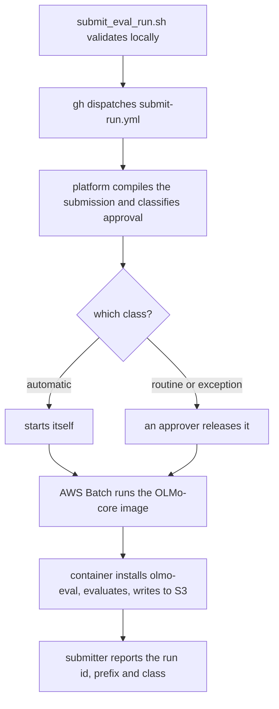

# Evaluate a training checkpoint through the platform

This skill submits an AWS Batch job. A GPU is allocated for you, so you need no
AWS credentials and no machine of your own — and in exchange you get one checkpoint
per submission and no say in where the results land.

**If you have your own GPU box, use the `eval-direct-gpu` skill instead.** It sweeps
many checkpoints in one invocation, writes to an S3 path you choose, and boots vLLM
rather than the slower in-process provider this path is limited to. It is also the
proven path: it has completed a real run, and this one has not yet.

`scripts/run_eval_sweep.sh` is still present here and still works, but
`eval-direct-gpu` is its documented home and the copy to prefer.

**Which benchmarks exist, what they score, what they cost, and what they report are
all in [BENCHMARKS.md](BENCHMARKS.md).**

---

## If you are an agent asked to run this

Four inputs have no default and cannot be inferred. **Ask for them.** Everything
else you propose, stating the default so the user can accept it silently.

1. **The checkpoint.** One S3 directory. It **must** sit under
   `s3://sbsandbox-intern-edullm-outputs/teams/<team>/runs/<run-id>/…` — the eval
   job's role can read nowhere else. Training runs on this platform already write
   there. If the user has no path, ask; see [CHECKPOINTS.md](CHECKPOINTS.md).
   Never construct one.
2. **The team.** One of `platform`, `memory-split`, `input-core`, `pre-training`,
   `post-training`, `data-prep`, `eval-inference`, `scratch`. It routes the
   approval, charges a cost centre, and fixes the output prefix. It grants nothing.
3. **An experiment slug.** Lower-case with hyphens. Groups related runs.
4. **A W&B project.** Free text; the entity is always `eduLLM`. The form requires it.

Then say what you will default to: `--group smoke` for a first run,
`gpu-1xa10g` at about $1/hour, a 2-hour bound, one checkpoint. Say also that the
run will wait for a team lead, and see
[What to say about approval](#what-to-say-about-approval) before saying anything
more specific than that.

**Tell the user up front that the output location is not theirs to choose.**
Results land at `s3://sbsandbox-intern-edullm-outputs/teams/<team>/runs/<run-id>/`,
where `<run-id>` is minted at submission. Say so before the run, not after.

Then, in this order:

- **Choose a batch size** from the checkpoint's parameter count, for anything past
  a smoke run. The provider's default is one forward pass for every prompt, which
  runs out of memory after the machine has been paid for. See
  [Setting the batch size](#setting-the-batch-size-which-the-agent-must-do).
- **Propose fanning out** if the request is a full sweep rather than a smoke run.
  Three jobs cut elapsed time by roughly 2.5x on `--group all`, though only about
  1.6x on `--group default`, where hellaswag dominates. See
  [Fanning out](#fanning-out-across-about-three-jobs). Say which shares you would
  send and that recombining the wide table is a manual merge.
- **Run with `--dry-run` first, always.** It validates the checkpoint path, the
  team, the benchmark names and the cost, and dispatches nothing.
- Show the user the resolved plan and the command, and get confirmation.
- Drop `--dry-run`. Report the run id and the output prefix.

### What to refuse

- **Guessing a checkpoint path.** It cannot be derived. Ask.
- **Promising a client-chosen output prefix.** The platform picks it.
- **`--allow-any-task`** to force through a benchmark with no working task. It
  bypasses this registry, not olmo-eval's, so it cannot make one exist.
- **A CPU compute profile.** The CPU role holds no `s3:GetObject`, so the job is
  admitted, approved, placed, and then dies on its first read.
- **Reporting smoke scores as results.** They are a plumbing check.
- **Telling the user a run was auto-approved, or will be.** You do not compute
  that and neither does the submitter. See
  [What to say about approval](#what-to-say-about-approval).
- **Plotting the `mc_format` group as the training curve.** It re-asks three of
  the default benchmarks in labelled A/B/C/D form, which reads near chance until
  a model can bind a letter to an option. It is a cross-check on the curve, not
  the curve; BENCHMARKS.md says when it is worth running.

---

## Submitting through the platform

```bash
bash .cursor/skills/eval-platform/scripts/submit_eval_run.sh \
  --checkpoint s3://sbsandbox-intern-edullm-outputs/teams/pre-training/runs/run_019f.../checkpoints/step2000 \
  --team pre-training --experiment my-first-eval --wandb-project edullm-evals \
  --group smoke --dry-run
```

Drop `--dry-run` to submit. Requires the `gh` CLI, authenticated. **No AWS
credentials** — the platform assumes its own roles through GitHub OIDC.

### Inputs

| Flag | Default | Meaning |
|---|---|---|
| `--checkpoint` | required | One OLMo-core checkpoint directory, under the outputs bucket |
| `--team` | required | One of the eight; routes approval and fixes the output prefix |
| `--experiment` | required | Lower-case slug grouping related runs |
| `--wandb-project` | required | Free text; entity is always `eduLLM` |
| `--group NAME` | the registry's `default` | A named benchmark set. `smoke` is the 2-instance plumbing check. Omitting it *and* `--benchmarks` resolves the full default sweep, and the submitter says so loudly rather than letting a forgotten `--group smoke` pass as one |
| `--benchmarks "a b c"` | (see `--group`) | Explicit task names; conflicts with `--group` |
| `--limit N` | (the group's, if any) | Instances per benchmark; overrides a group's own |
| `--batch-size N` | (all prompts in one pass) | Prompts per forward pass, sent as `provider.kwargs.batch_size`. Set it for anything past a smoke run |
| `--override KEY=VALUE` | none | Any other harness override, repeatable. No quotes or whitespace in the value |
| `--compute-profile` | `gpu-1xa10g` | The machine. Must be a GPU profile |
| `--runtime-hours` | `2` | Overrides the workload profile's 1-hour bound. A hard timeout, not a budget; see [approval](#what-to-say-about-approval) for why it is not lower |
| `--tokenizer ID` | (from config) | HF tokenizer, if the checkpoint names none |
| `--eval-ref SHA` | `HEAD` | Full 40-hex commit of *this* repo to run. Must be pushed |
| `--allow-any-task` | off | Permit tasks outside the registry |
| `--dry-run` | off | Validate and print; dispatch nothing |
| `--no-wait` | off | Dispatch and exit without polling for the run id |

### What happens



The submitter validates, dispatches, then reads the run id out of the workflow's
`compiled-submission` artifact — the step summary carries it too but no API
exposes that.

### What to say about approval

**The class is the platform's to decide, and it is a fact you can read rather
than one to predict.** The same `compiled-submission` artifact the submitter
already opens for the run id carries `approval_class`, so the submitter prints
the platform's own answer — `automatic`, `routine` or `exception` — beside the
run id. Report that. Do not restate the rule that produced it and do not work it
out yourself: the thresholds live in the platform repo, they are versioned, and
the ones in force are whatever was packaged into the deployed admission
validator rather than whatever is on main.

Until that line prints there is nothing to report, so **on a `--dry-run`, or
with `--no-wait`, say only that the platform has not classified it yet.**

What you can say up front, because it follows from the defaults rather than from
a threshold: **a run submitted through this skill waits for a team lead.**
Automatic release requires a runtime bound strictly under one hour, and the
default bound is two — deliberately. That bound is a hard timeout the job is
killed at, on a workload profile that allows a single attempt, and before the
first prompt is scored the container installs git, installs olmo-eval and
transformers, downloads the checkpoint, and pulls the benchmark data. Trading
that headroom for one fewer click is a bad trade, and it is a worse one on a
full sweep, which the default `--group` is.

### Why it runs on the OLMo-core image

The submission names `repository=OLMo-core`, not this repo, and that is
deliberate. The published `olmo-eval-full` image leaves torch and vLLM out, so it
can only run `provider.kind=mock` and cannot evaluate a model at all. The
OLMo-core image carries CUDA torch and `ai2-olmo-core`, which is exactly what
olmo-eval's `olmo_core` provider needs, so the job rides on that image and
installs olmo-eval into it at start-up.

Three consequences worth knowing:

- **The provider is `olmo_core`, not vLLM.** It loads a native OLMo-core
  checkpoint directly, so no HF conversion happens. It is also slower per prompt
  than vLLM, since it has no paged batching. Fine for a smoke run; a full sweep
  is where building a proper eval image starts paying for itself.
- **Start-up installs git and olmo-eval.** olmo-eval declares `ifbench` as a
  `git+https` dependency and the OLMo-core image has no git, so the command
  installs it first. Budget a couple of minutes before the eval begins.
- **The lineage record will name OLMo-core's commit**, not this repo's. That is
  the provenance property the platform normally guarantees, and this route opts
  out of it. `--eval-ref` is pinned to a full commit sha and recorded in the
  run's own `eval_provenance.json`, which is the only place the two are written
  down together.

### Setting the batch size, which the agent must do

**The `olmo_core` provider's `batch_size` defaults to `None`, and `None` means
every prompt in one forward pass.** At 36 prompts that is fine. At 65,315 it is
an out-of-memory crash after the machine has been allocated. So for anything
past a smoke run, pass one:

```bash
--batch-size 64
```

The submitter forwards that to the runner as
`provider.kwargs.batch_size`, and warns if a run over 1,000 prompts does not
carry one. `--override KEY=VALUE` is the escape hatch for other provider kwargs.

Pick it from the model's parameter count and the GPU's memory. Weights take
2 bytes per parameter at bf16 and are fixed; what is left over holds the
activations, and batch size is how many sequences share that space.

| Parameters | Weights | 16 GB (`gpu-1xt4`) | 24 GB (`gpu-1xl4`, `gpu-1xa10g`) | 48 GB (`gpu-1xl40s`) | 80 GB (`gpu-1xh100`) |
|---|---|---|---|---|---|
| up to 500M | ~1 GB | 64 | 64 | 128 | 256 |
| ~1B | 2 GB | 32 | 64 | 128 | 256 |
| ~3B | 6 GB | 16 | 48 | 128 | 256 |
| ~7-8B | 14-16 GB | does not fit | 16 | 96 | 192 |
| over 8B | over 16 GB | no | no | measure | measure |

These are **starting points, not measurements.** The rule behind them is
`headroom = gpu_gb - 2 x params_billions - 2` for CUDA overhead, then roughly
four sequences per free gigabyte, which is deliberately conservative for the
short prompts these benchmarks use. If a run survives, double it; if it crashes
with an out-of-memory error, halve it. The smoke run is the cheap place to find
the ceiling, and it is worth doing that deliberately before a long sweep.

To get the parameter count, read the checkpoint's `config.json`: its `model`
section names `d_model`, `n_layers` and `vocab_size`, and a transformer is
roughly `12 x n_layers x d_model^2 + vocab_size x d_model` parameters. **If that
is not readable, ask the user** — they trained the model and will know. Do not
guess a size from the checkpoint's byte count: a native OLMo-core checkpoint
stores optimizer state alongside the weights, so the directory is several times
the model.

One thing this knob cannot fix: `tensor_parallel_size` must be 1. The provider
refuses anything else, so a multi-GPU shape buys nothing here and you are picking
between single-card sizes.

### Fanning out across about three jobs

One submission evaluates one benchmark list on one machine, so the way to cut
elapsed time is to send the benchmarks as several submissions that run at once.
**Split a full sweep across about three jobs.** Each is an ordinary
`submit_eval_run.sh` call with `--benchmarks` naming its own share, the same
`--checkpoint`, and the same `--experiment` so the three stay grouped:

```bash
# job 1 -- hellaswag alone, because it is the largest single benchmark
--benchmarks "hellaswag"
# job 2
--benchmarks "popqa arc_easy socialiqa piqa"
# job 3
--benchmarks "triviaqa csqa naturalqs jeopardy"
```

Split by **prompts, not by benchmark count**, because the benchmarks are nowhere
near equal. Multiple-choice scoring issues one prompt per answer choice, so
hellaswag's 10,042 instances become 40,168 prompts — 39% of the nine-benchmark
sweep on its own. The three shares above are roughly 40.2k, 33.3k and 29.8k
prompts out of 103,253.

**Expect about 2.5x, not 3x.** Elapsed time is set by the slowest job, and
hellaswag is too big to pair with anything, so it becomes the floor. The same
split on `--group default` is worse still: hellaswag is 61% of that set's 65,315
prompts, so three jobs buy only about 1.6x. Fan-out pays on `all` and barely pays
on `default`. Splitting hellaswag itself is not available — `--limit` draws a
random subsample of the split, it does not shard it, so two half-limit jobs would
overlap on some instances and miss others, and no combination of them adds back
up to the full run.

Treat those prompt counts as a proxy and not a measurement. A generative prompt
runs a decode loop of up to 32 tokens while a multiple-choice prompt is a single
forward pass, so triviaqa and popqa cost more per prompt than their share
suggests. If a smoke run has given you per-prompt timings for both kinds, weight
by those instead.

**Three, rather than as many as possible.** Every job re-pays the same fixed
cost before it scores anything: `apt-get` for git, the olmo-eval install, and the
model load. That is minutes, it does not shrink as shares get smaller, and it is
charged per job — so total GPU-hours rise while elapsed time falls. Three
concurrent single-GPU jobs is also a modest capacity ask, which matters because
`config/capacity.yaml` marks several profiles as placing unreliably and a job
that cannot get capacity sits in `RUNNABLE` with nothing watching it. The default
`gpu-1xa10g` is not one of those.

Each job still needs its own `--batch-size`, and each lands in its own
platform-assigned prefix, so **record all three run ids** — the submitter prints
each one and they are not derivable afterwards.

**Recombining is a manual step.** Sync the three prefixes into one local
directory and `summarize_accuracy.py --runs-dir` over it reads all three, because
the layout it wants is exactly `<dir>/<run-id>/metrics.json`. But it keys rows on
run id rather than on the checkpoint, so `accuracy_wide.csv` comes back as three
partial rows for one checkpoint — each carrying its own shard's columns and blanks
elsewhere — instead of one complete row. The long `accuracy.csv` is unaffected,
since it is one row per benchmark and metric anyway. Merge the wide rows on the
`checkpoint` column before plotting a training curve.

### Outputs

```
s3://sbsandbox-intern-edullm-outputs/teams/<team>/runs/<run-id>/
  metrics.json            olmo-eval's standard output, one entry per benchmark
  predictions/  requests/ per-instance JSONL
  eval_provenance.json    checkpoint, benchmarks, the exact command, this repo's commit
  _READY | _FAILED        terminal marker, always written
  _IN_PROGRESS            heartbeat while running; gone once a terminal marker exists
```

`eval_provenance.json` is written *before* the eval starts and rewritten when it
ends, so a job killed for running out of time still leaves something saying what
it was doing. The platform audits for runs that saved nothing.

### What a crashed run leaves

The output tree is copied up every few minutes rather than only at the end, so a job
that dies keeps the instances it had already scored. `--upload-interval` sets the
period; `0` restores upload-only-at-the-end.

**A surviving `_IN_PROGRESS` means the job died.** `_READY` and `_FAILED` are both
written by the process doing the eval, so a hard kill — out of memory, spot reclaim,
hitting the runtime ceiling — leaves neither, and a prefix with no marker at all cannot
be told from one that never started. `_IN_PROGRESS` carries the time of the last upload,
so a stale one dates the death and says that what sits beside it is everything that
survived.

Two kinds of prediction file can appear. A benchmark that finished has its ordinary
`<name>-predictions.jsonl` and an entry in `metrics.json`. A benchmark that was still
running has `<name>-predictions.partial.jsonl` instead, holding the rows scored before
the crash, and **no** `metrics.json` entry — a mean over whichever instances the queue
happened to reach is not that benchmark's accuracy, and putting it in `metrics.json`
would let it be read as one.

To score what survived:

```bash
aws s3 sync s3://.../runs/<run-id>/ ./salvaged
python .cursor/skills/eval-platform/scripts/salvage_partial.py --runs-dir ./salvaged
```

It reports each benchmark's instance count and mean, labels the interrupted ones, and
exits non-zero if a file is damaged beyond truncation. **Expect the last line of a
partial file to be cut off**: the upload copies it while it is still being appended to,
so whatever was mid-write arrives incomplete. That line is dropped with a note, which is
normal rather than a sign of a problem.

To watch or stop a run, dispatch **Look at a run, or stop it** in the platform
repo with the run id; it only stops the job if you tick stop. Cancelling the
submit workflow does *not* stop the job. Nothing watches the queue, so if a run
has not started within an hour, ask.

---

## Running on a machine you own

`scripts/run_eval_sweep.sh` is the non-platform path: it discovers checkpoints
under a prefix, converts native ones to HF, boots vLLM and sweeps them. It needs
a GPU, the `aws` CLI, AWS credentials, and this repo checked out. Run
`scripts/run_eval_sweep.sh --help` for its full interface, and
`scripts/bootstrap.sh` to install the environment on a bare box.

Use it when you already have the machine. Prefer the platform otherwise: it
allocates the GPU, records the run, and needs no credentials from you.

That path is also the one that uses `provider.kind=vllm_server`, so **its numbers
are not directly comparable to the platform path's** — different inference
backend, and for generative tasks that can move a score. Compare like with like.

---

## How it maps to olmo-eval

This skill owns no evaluation logic. It resolves benchmark names, stages a
checkpoint, shells out to olmo-eval once, and reports where the JSON went.

Argument order is not cosmetic. `run` has no top-level `--provider`; it goes
through `--harness`. Each `-o` binds to the *preceding* `--harness` or `-t`, and
the two accept disjoint key sets, so a `provider.*` key after `-t` is a usage
error and a `limit=` before the first `-t` is one too.

Scores are read from `tasks[].metrics` in `metrics.json`, not the top-level
`summary` block — `summary` carries only each task's primary metric, which would
drop the second metric on any task reporting more than one.

## Files

| File | Role |
|---|---|
| `scripts/submit_eval_run.sh` | submit one checkpoint to the platform |
| `scripts/resolve_benchmarks.py` | the registry's one resolver, shared by both paths |
| `scripts/benchmarks.json` | the benchmark registry; the only place names live |
| `src/olmo_eval/platform/run_eval.py` | what runs *inside* the Batch job |
| `scripts/run_eval_sweep.sh` | the non-platform sweep |
| `scripts/bootstrap.sh` | installs the environment on a bare GPU box |
| `scripts/convert_to_hf.py` | native OLMo-core to HF, for the vLLM path |
| `scripts/summarize_accuracy.py` | reads `metrics.json`, writes the accuracy tables |
| `BENCHMARKS.md` | what each benchmark scores, costs and reports |
| `CHECKPOINTS.md` | what to ask the user for, and how to verify it |
| `tests/` | the verification suite; see below |

## Verifying a change

```bash
python .cursor/skills/eval-platform/tests/run_tests.py
```

About 90 seconds, and it needs no AWS credentials, no GPU and no network — every
case runs with `--dry-run` or against shimmed `aws`/`uv` executables. Run it
after editing anything here.

It covers the seams rather than the evaluation: that every name in
`benchmarks.json` is a real olmo-eval task, that the argv both paths emit parses
against olmo-eval's own parser, that the submitted command survives being split
by `shlex` and then by bash, and that the accuracy tables keep a failed
checkpoint visible. The bash half needs a real bash and is skipped with a note if
there is none. [tests/README.md](tests/README.md) has the details.

## Additional resources

- Adaptive testing (far fewer items per checkpoint) is on hold. The rationale,
  the measured limits, and what it would take to revisit:
  `AdaptiveTesting/docs/05_cat_deferred.md`
