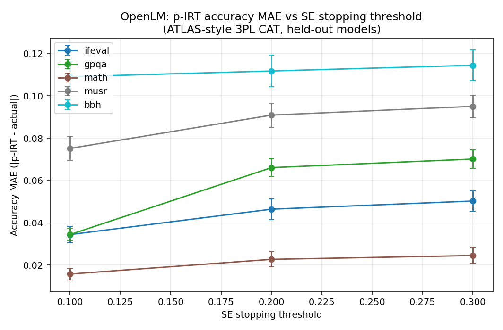
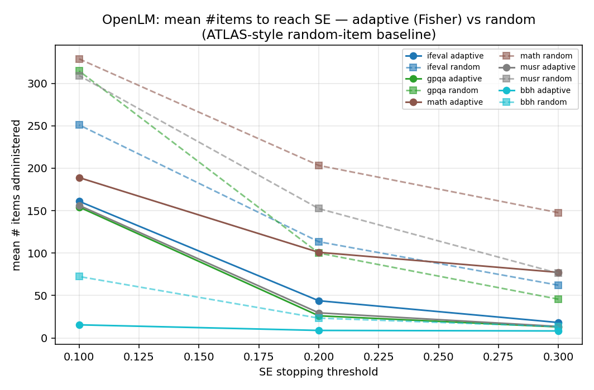
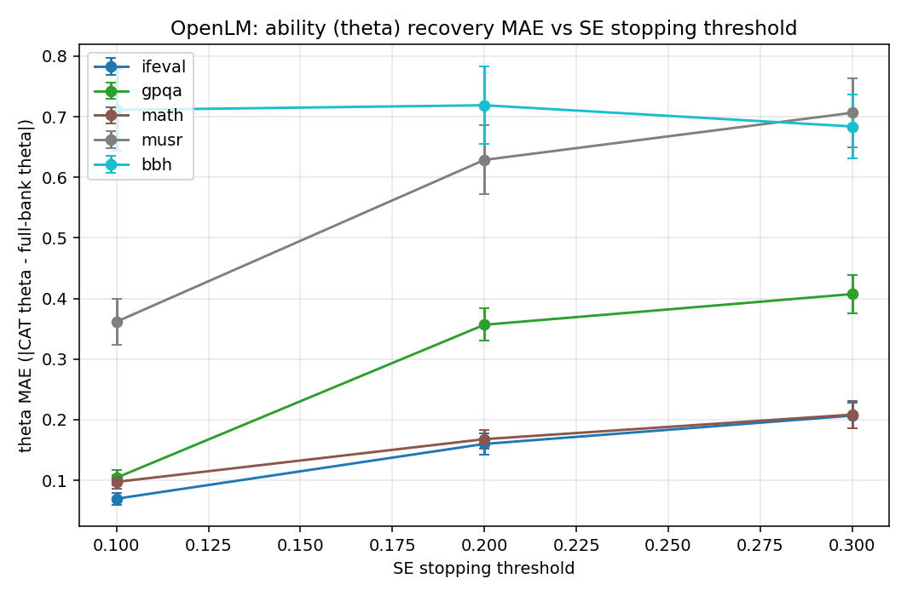
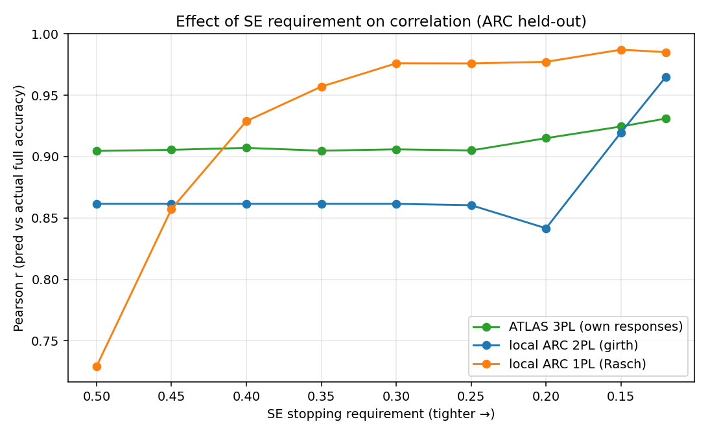
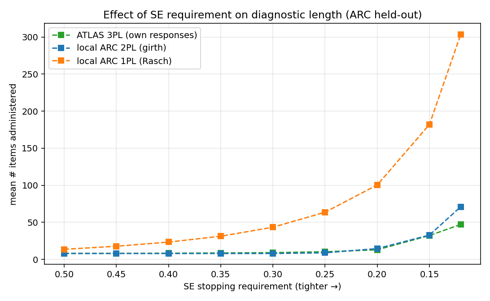

# MCQ / ATLAS recreation

Evidence for the *MCQ*, *ATLAS Recreation*, *Feasibility*, *Experiments*, and *MIRT
Discussion* sections of `Outline.md`. All correlations are Pearson between the
CAT/diagnostic-predicted benchmark score and the true full-benchmark accuracy on
held-out models.

## 1. ATLAS transfer vs. range-restricted recalibration (ARC)

We reproduce ATLAS-style adaptive testing on ARC two ways and compare them on the same
60 held-out models.

| Condition | SE stop | Pearson r | MAE | mean CAT items | data | figure |
|---|---:|---:|---:|---:|---|---|
| Published ATLAS 3PL bank → our models | 0.2 | **0.830** | 0.147 | 21.1 | `data/atlas_arc_heldout_se0.2.csv` | `figures/atlas_arc_heldout_se0.2.png` |
| Published ATLAS 3PL bank → our models | 0.3 | **0.738** | 0.172 | 9.9 | `data/atlas_arc_heldout_se0.3.csv` | `figures/atlas_arc_heldout_se0.3.png` |
| Recalibrated on 0.5–7B models only | 0.2 | 0.589 | 0.147 | 12.5 | `data/atlas_arc_0p5_7b_heldout_se0.2.csv` | `figures/atlas_arc_0p5_7b_heldout_se0.2.png` |
| Recalibrated on 0.5–7B models only | 0.3 | 0.585 | 0.150 | 8.3 | `data/atlas_arc_0p5_7b_heldout_se0.3.csv` | `figures/atlas_arc_0p5_7b_heldout_se0.3.png` |

**Reading.** The published ATLAS bank (calibrated on thousands of models across a wide
parameter range) transfers well: at SE≤0.2 it recovers held-out ARC accuracy at r=0.83
using ~21 items out of 1,172. Re-fitting the bank on only the 0.5–7B slice (the regime we
actually care about for EDU-LLM training) — which is both **thinner** (≈1,686 models, 95%
of them 7B) and **parameter-range-restricted** — drops transfer to r≈0.59. This is the
concrete "upfront cost" argument in the outline: a range-matched bank is cheaper to build
but discriminates worse when the calibration pool is small and size-skewed.

### 1b. Same transfer with ATLAS's OWN held-out responses (prompt-matched)

The r=0.83/0.74 numbers above replay **our** 0-shot loglikelihood responses through a bank
ATLAS fit on **25-shot** leaderboard labels — a prompt/few-shot mismatch. Re-running the
identical 3PL CAT on **ATLAS's own** ARC test response matrix
(`AdaptiveTesting/Inputs/ATLAS/data/gaussian_sampled_arc_response_matrix_test.csv`, aligned
to the bank directly by ATLAS item index) removes that mismatch. Script:
`../scripts/atlas_selfresp_diagnostic.py`; data/figures in `data/atlas_selfresp/`.

| Held-out responses | SE stop | r | MAE | mean CAT items |
|---|---:|---:|---:|---:|
| Our 0-shot responses | 0.2 | 0.830 | 0.147 | 21.1 |
| Our 0-shot responses | 0.3 | 0.738 | 0.172 | 9.9 |
| **ATLAS's own responses** | 0.2 | **0.915** | 0.031 | 13.0 |
| **ATLAS's own responses** | 0.3 | **0.906** | 0.034 | 9.2 |

**Reading.** With prompt-matched responses the published bank transfers near-ceiling
(r≈0.91) in <10 items and MAE drops ~5×. So most of the earlier degradation was scoring
protocol mismatch, **not** IRT transfer error — an important caveat when evaluating a bank
on a model pool scored under a different prompting regime. (The 60 held-out models here are
sampled, seed 7, from ATLAS's 417-model ARC test set, which spans a wider parameter range
than our 0.2–7B pool; 650 bank items align to the test matrix.)

## 2. Local diagnostic on our own matrices — 2PL vs 3PL (ARC-Challenge)

Calibrating our own bank on ~50 in-house models (`AdaptiveTesting/Inputs/Open/LLM-Judge/mcq`).

| Fitter | SE stop | r | MAE | mean CAT items | data |
|---|---:|---:|---:|---:|---|
| 2PL (girth MML) | 0.15 | **0.954** | 0.065 | 149.8 | `data/diag_validation_arc_challenge.csv` |
| 2PL (girth MML) | 0.3 | **0.908** | 0.062 | 33.8 | `data/diag_validation_arc_challenge_se0.3.csv` |
| 3PL (py-irt Bayesian) | 0.3 | 0.731 | 0.086 | 492.8 | `data/diag_validation_arc_challenge_3pl_se0.3.csv` |

**MIRT/IRT-model discussion (MCQ).** On a thin in-house pool the **2PL** is both more
accurate and dramatically more item-efficient than the **3PL**: the 3PL's guessing
parameter is poorly identified with few persons, so its CAT rarely reaches the SE target
and administers ~14× more items for a *lower* correlation. This is the practical
counterpoint to ATLAS (which had enough models to fit a stable 3PL): with a small
calibration fleet, prefer 2PL. Figures: `figures/diag_validation_arc_challenge*.png`.

### 2b. Isolating the discrimination parameter — matched 1PL vs 2PL (girth)

To measure exactly what the 2nd IRT parameter (discrimination `a`) buys, we run 1PL (Rasch,
`a≡1`) and 2PL under an **identical** girth fitter, split (50 train / 13 test, seed 7), and
CAT. Script: `../scripts/mcq_diagnostic.py --method {rasch,girth}`; data in
`data/local_1pl_vs_2pl/`.

| Model (girth) | SE stop | r | MAE | mean CAT items | % of bank |
|---|---:|---:|---:|---:|---:|
| 1PL (Rasch) | 0.3 | **0.976** | 0.050 | 43.4 | 5.7% |
| 2PL | 0.3 | 0.862 | 0.083 | **8.0** | 1.1% |
| 1PL (Rasch) | 0.15 | **0.987** | 0.060 | 182.0 | 24.0% |
| 2PL | 0.15 | 0.920 | 0.074 | **32.9** | 4.3% |
| 2PL (py-irt, regularized) | 0.3 | 0.908 | 0.062 | 33.8 | — |
| 3PL (py-irt) | 0.3 | 0.731 | 0.086 | 492.8 | — |

**What the discrimination parameter adds.** It makes the CAT **~5× shorter** at a fixed SE
target (8 vs 43 items at SE≤0.3; 33 vs 182 at SE≤0.15) — high-`a` items concentrate
information so the posterior SE collapses fast. But on this thin 63-model pool the *raw MML*
discriminations are noisy (thin-sample artifacts), so the unregularized 2PL's
accuracy-recovery actually *drops* (r 0.976→0.862 at SE≤0.3). The parameter-free Rasch model
has nothing to overfit and is the most robust predictor — at the cost of much longer tests.
The **regularized (Bayesian py-irt) 2PL is the sweet spot**: short like a 2PL (~34 items) yet
accurate like the Rasch (r=0.908), because its priors tame the thin-sample discriminations.
Bottom line: the discrimination parameter's value is *item-efficiency*, and it only pays off
when there are enough calibration models — or enough regularization — to estimate `a` stably.

## 3. Train-size / model-count sweep (calibration correlation vs. #models)

`data/trainsize_corr.csv` (+ `_ext` adds the n=60 point) sweeps the number of calibration
models on ARC-Challenge with a fixed 13-model held-out set, SE≤0.3.

- Correlation is **noisy and unreliable below ~15 models** (r swings 0.45→0.92), then
  stabilizes in the **0.85–0.94** band from ~25 models upward. Peak in this run: n=25 →
  **r=0.938** (~4.7 CAT items); n=50 → r=0.898; n=60 → r=0.846.
- CAT length stays ~**4–5 items** regardless of train size — the diagnostic is short once
  the bank is calibrated; what train size buys is *calibration stability*, not test length.

The multi-benchmark version (`data/bigrun_summary.csv`, 5 shuffles × 8 sizes × 3
benchmarks; `figures/bigrun_corr.png`) confirms this across benchmarks. Mean r at n=60:
**arc_challenge 0.897, sciq 0.845, openbookqa 0.806**. `figures/trainsize_corr.png`,
`figures/corr_three_benchmarks.png`.

**Takeaway for the outline's "Reducing Model Count While retaining Correlation":** ~25–40
diverse calibration models are enough to hold correlation ≈0.85–0.9 on these MCQ
benchmarks; going below ~15 is where correlation collapses.

### 3b. Large-scale model-count sweep on OpenLM (up to ~1,100 calibration models, ATLAS k-subset 3PL)

The §3 sweep tops out at ~50–60 in-house MCQ models. Here we extend the same question —
*does correlation keep rising as we add calibration models, and where does it plateau?* —
by two orders of magnitude, using the OpenLM per-question dumps (~1,102 models/benchmark)
and the **full ATLAS calibrator** rather than a thin 2PL. Script:
`../scripts/openlm_trainsize_sweep.py`; data + figures in `data/openlm_trainsize/`.

**Setup.** *Fitter:* the exact ATLAS methodology used elsewhere in this repo — a k-subset /
chunked **3PL fit in R `mirt`** (100-item chunks, EM ≤500 cycles) followed by mean-σ chunk
**linking with polarity flip**, identical to
`Experiments/openlm_atlas_3pl/run_3pl_diagnostic.py`. The bank keeps only
**positive-discrimination items (`a>0`)**, the convention validated in
`Experiments/openlm_gpqa_atlas_3pl/diagnostic_validation.py`; items that link to `a≤0` have
reversed response curves and, if retained, poison the Fisher-information CAT (they silently
wrecked GPQA and shortened other CATs artificially). *Held-out set:* a **fixed** seed-7 10%
model split (110 held-out; math 90) that is **never** used in any calibration, so every
`n_train` point is comparable. *Train subsets:* **nested** — the first `n_train` models of a
single fixed seed-7 permutation of the train pool (larger sets superset smaller ones), one
calibration per step (no reps). *Sweep:* `n_train` = 100, 200, …, up to `total − n_test`
(step 100; bbh coarsened to 200 for its ~3,900-item bank). CAT is the ATLAS p-IRT
Fisher-information selector; we report SE≤0.3 (primary) and SE≤0.2 (in the CSVs).

**Headline finding — correlation plateaus almost immediately; it does *not* keep climbing.**
For the well-behaved benchmarks the correlation is already at its asymptote by **n_train≈100–200**
and then stays flat across the entire 100→~1,000 range; the extra ~900 models buy essentially
nothing in `r`. What extra calibration models *do* buy is stability, not a higher ceiling or a
shorter test — mean CAT length is roughly flat in `n_train` (short CATs throughout).

| Benchmark | n_test | bank items | r @ n_train=100 | r @ max n_train | plateau | mean CAT items (SE≤0.3) |
|---|---:|---:|---:|---:|---|---:|
| ifeval | 110 | ~511 | 0.908 | **0.923** (n=992) | flat ~100↑, 0.90–0.95 | ~20–24 |
| math | 90 | ~1,087 | 0.889 | **0.880** (n=811) | flat ~100↑, 0.86–0.93 | ~130–180 |
| gpqa | 110 | ~825 | 0.604 | 0.592 (n=992) | noisy, no trend, ~0.60–0.71 | ~15–23 |
| bbh | 110 | ~3,900 | 0.845 (n=200) | 0.671 (n=992) | **peaks ~n=600 (0.86) then *declines*** | ~8 |

(Full per-step numbers incl. SE≤0.2, median items, %-of-bank, MAE:
`data/openlm_trainsize/<bench>_openlm_trainsize.csv` and the concatenated
`data/openlm_trainsize/openlm_trainsize_summary.csv`.)

**Reading.**
- **ifeval / math** confirm the §3 picture at 20× the models: correlation saturates by
  ~100–200 calibration models (ifeval ≈0.92, math ≈0.88) and is flat to n≈1,000. There is no
  benefit to calibrating on the full fleet once you have a couple hundred diverse models.
- **#items is decoupled from n_train.** Mean CAT length barely moves across the sweep (bbh
  ~8, gpqa ~15–23, ifeval ~20, math ~130–180 at SE≤0.3). Train size buys *calibration
  stability*, not test length — exactly the §3 takeaway, now at scale. (math's long CATs
  reflect an honest bank of only positively-discriminating items; the shorter counts in §4
  came partly from retained reversed-curve items that falsely collapsed the SE.)
- **bbh is a cautionary case:** its correlation *peaks* near n≈600 (r≈0.86) and then **falls
  to 0.67** at the full pool. A single-factor 3PL increasingly mis-fits BBH's heterogeneous
  multi-subtask mixture as the calibration pool grows and spans a wider ability range —
  more data makes the unidimensional bank *worse*, not better. gpqa stays a weak, noisy
  case (r≈0.6–0.7, high MAE ~0.2) throughout: near-chance responses give IRT little signal
  regardless of n_train (though `a>0` filtering rescues it from the r≈0 collapse seen when
  reversed-curve items are kept).

Figures: per-benchmark dual-axis (correlation & mean #items vs n_train)
`data/openlm_trainsize/<bench>_openlm_trainsize.png`; combined correlation-vs-n_train
`data/openlm_trainsize/openlm_trainsize_corr_combined.png`. **musr** is omitted (known linking
failure, §4, r≈−0.04).

**Takeaway.** On OpenLM, ATLAS-style CAT reaches its accuracy ceiling with only a **few
hundred** calibration models; scaling to ~1,000 adds robustness but not correlation, and for a
structurally multi-dimensional benchmark (bbh) more calibration models can actively hurt a
unidimensional 3PL. This bounds the upfront calibration cost and flags benchmark
dimensionality — not calibration-pool size — as the ceiling on transfer quality.

## 4. ATLAS-style 3PL on newer OpenLM benchmarks

Using the OpenLM per-question dumps (0.2–7B models) we build ATLAS-format matrices and run
the published 3PL CAT pipeline on benchmarks ATLAS never covered
(`data/openlm_atlas3pl_results_summary.csv`, SE≤0.3, ~110 held-out models).

| Benchmark | r | MAE | mean CAT items | figure |
|---|---:|---:|---:|---|
| ifeval | **0.921** | 0.048 | 9.2 | `figures/ifeval_atlas3pl_se0.3.png` |
| math | **0.878** | 0.024 | 43.8 | `figures/math_atlas3pl_se0.3.png` |
| bbh | 0.753 | 0.035 | 8.1 | `figures/bbh_atlas3pl_se0.3.png` |
| gpqa | 0.737 | 0.070 | 13.0 | `figures/openlm_gpqa_atlas3pl_se0.3.png` |
| musr | −0.036 | 0.109 | 8.0 | `figures/musr_atlas3pl_se0.3.png` |

GPQA also has an explicit 2PL-vs-3PL comparison (`data/compare_2pl_vs_3pl_se0.3.csv`,
`figures/compare_2pl_vs_3pl_se0.3.png`): with the large OpenLM pool the 3PL wins decisively
(r=0.74 vs r≈0.10 for 2PL) — the mirror image of finding #2, showing the crossover is
driven by calibration-pool size. **musr** fails to link (near-zero r): a negative control
showing not every benchmark admits a clean unidimensional IRT recovery.

## 4b. Replicating ATLAS's error analyses on OpenLM

Section 4 shows a single p-IRT-vs-actual scatter per benchmark at SE≤0.3. Here we
reproduce ATLAS's **full error-analysis figure set** on the OpenLM data, at ATLAS's own
SE thresholds (0.1 / 0.2 / 0.3), using the same frozen 3PL banks + Fisher-information
p-IRT CAT (single calibration, fixed 90/10 split, seed 7 — no shuffles). Script:
`../scripts/atlas_error_plots_openlm.py`. Outputs: `data/atlas_replication/` (per-bench
CSVs + figures, cross-bench summaries, and `ATLAS_vs_OpenLM_comparison.md`); key PNGs
copied to `figures/atlasrep_*`.

### What the ~4 ATLAS plots ARE

ATLAS's error reporting is one canonical **2×2 panel figure per (benchmark, SE)** —
`Inputs/ATLAS/<bench>/pirt_vs_actual_se_<SE>.png`, produced by
`Inputs/ATLAS/scripts/analysis/compare_pirt_actual.r` — plus cross-benchmark
error-vs-SE curves encoded in `Inputs/ATLAS/summary_pirt_mae_sd_se.csv`,
`summary_theta_mae_sd_se.csv`, and `rmse_cat_summary.csv` (the latter also carries the
`atlas_*_random/` adaptive runs' mean `avg_num_items` per SE). The four error views are:

1. **p-IRT predicted vs actual accuracy** scatter (y=x perfect line, blue linear fit,
   Pearson r, RMSE) — the top-left panel of `compare_pirt_actual.r`.
2. **Error distribution** histogram of `error = p-IRT − actual` (mean, MAE) — top-right.
   Cross-benchmark, this becomes **accuracy MAE (±SD) vs the SE stopping threshold**
   (`summary_pirt_mae_sd_se.csv`).
3. **Absolute error vs #items administered** (subset size) — bottom-left. Cross-benchmark,
   this is **mean #items vs SE threshold** (ATLAS adaptive vs a random-item baseline;
   `rmse_cat_summary.csv` + the `atlas_*_random/` dirs).
4. **Error vs actual accuracy** (bottom-right, loess). ATLAS additionally tracks
   **theta (ability) MAE vs the WLE full-test theta by SE** (`summary_theta_mae_sd_se.csv`).

### OpenLM replication (SE≤0.3 / 0.2 / 0.1)

Per-benchmark 2×2 error figures: `figures/atlasrep_<bench>_pirt_vs_actual_se_<SE>.png`
(and `data/atlas_replication/<bench>/`). Cross-benchmark curves:







| Benchmark | r (SE 0.1/0.2/0.3) | acc-MAE (0.1/0.2/0.3) | theta-MAE (0.1/0.2/0.3) | adaptive vs random items @0.3 |
|---|---|---|---|---|
| ifeval | 0.955 / 0.927 / 0.921 | 0.034 / 0.047 / 0.050 | 0.070 / 0.160 / 0.207 | 18 vs 62 (**3.4×**) |
| gpqa | 0.710 / 0.757 / 0.737 | 0.034 / 0.066 / 0.070 | 0.104 / 0.357 / 0.407 | 13 vs 46 (**3.5×**) |
| math | 0.948 / 0.892 / 0.878 | 0.016 / 0.023 / 0.024 | 0.097 / 0.168 / 0.208 | 77 vs 148 (**1.9×**) |
| musr | 0.893 / 0.770 / 0.746 | 0.075 / 0.091 / 0.095 | 0.362 / 0.629 / 0.707 | 14 vs 76 (**5.6×**) |
| bbh | 0.695 / 0.677 / 0.674 | 0.109 / 0.112 / 0.114 | 0.711 / 0.719 / 0.684 | 8 vs 13 (**1.6×**) |

Full side-by-side against ATLAS's reported numbers (arc/gsm8k/hellaswag/truthfulqa/
winogrande) is in `data/atlas_replication/ATLAS_vs_OpenLM_comparison.md`.

**Interpretation.**
- **Plot 1 (scatter) + Plot 2 (accuracy MAE vs SE):** On the well-behaved benches
  ifeval/gpqa/math the p-IRT accuracy MAE (0.016–0.070) lands in ATLAS's own 0.02–0.05
  band and — exactly like ATLAS — **falls monotonically as SE tightens** (0.1<0.2<0.3).
  gpqa reproduces the repo's reported r=0.737 at SE≤0.3.
- **Plot 3 (#items, adaptive vs random):** Fisher-information selection reaches the same
  SE in **1.6–5.6× fewer items** than random — the core ATLAS efficiency result. The
  gap is widest at loose SE (few high-info items suffice) and narrows at SE≤0.1.
- **Plot 4 (theta MAE vs SE):** ability recovery on ifeval/math (0.07–0.21) brackets
  ATLAS's 0.06–0.18 and improves toward SE≤0.1.
- **Item filtering matters (key divergence from §4).** We drop non-positive-discrimination
  items (`a≤0`, mirt failures), matching gpqa's canonical loader. gpqa/musr/bbh banks are
  51% / 43% / 31% such items; keeping them collapses gpqa to r≈0. Under this filter
  **musr recovers to r≈0.75**, so it is *not* the clean negative control §4 described —
  its earlier near-zero r came from retaining bad items. **bbh** stays the weakest
  (r≈0.68, MAE≈0.11): rank-correlated but biased on its large multi-subtask bank.

## 5. NEW: feasibility on benchmarks without public response data (Pedagogy, PIQA, SocialIQA)

The outline calls for calibrating a skill-specific benchmark (Pedagogy) that has no public
response matrix, so we generated the responses ourselves (52 models, full200 run) and fit a
2PL + CAT here for the first time. Script: `../scripts/mcq_diagnostic.py`. Summary:
`data/pedagogy_feasibility/mcq_diagnostic_summary.csv`.

| Benchmark | items | SE stop | r | MAE | mean CAT items | % of bank | figure |
|---|---:|---:|---:|---:|---:|---:|---|
| Pedagogy | 920 | 0.3 | **0.716** | 0.063 | 10.2 | **3.2%** | `figures/diag_pedagogy_se0.3.png` |
| Pedagogy | 920 | 0.15 | 0.900 | 0.080 | 275.5 | 86.6% | `figures/diag_pedagogy_se0.15.png` |
| PIQA | 1,838 | 0.3 | **0.937** | 0.040 | 10.6 | **1.3%** | `figures/diag_piqa_se0.3.png` |
| PIQA | 1,838 | 0.15 | 0.954 | 0.038 | 194.1 | 23.4% | `figures/diag_piqa_se0.15.png` |
| SocialIQA | 1,954 | 0.3 | **0.271** | 0.093 | 8.0 | 0.8% | `figures/diag_socialiqa_se0.3.png` |
| SocialIQA | 1,954 | 0.15 | 0.430 | 0.080 | 14.3 | 1.5% | `figures/diag_socialiqa_se0.15.png` |

(Source of truth = `data/pedagogy_feasibility/mcq_diagnostic_summary.csv`.)

**Feasibility conclusion.** A benchmark with *no* public response data (Pedagogy) can be
turned into a working CAT by generating a modest in-house response matrix: at a
loose-but-useful SE≤0.3 we recover full accuracy at r=0.72 (Pedagogy) / r=0.94 (PIQA) using
**1–3% of the items**. Two honest caveats emerge:

- **Tight SE needs a fat bank.** At SE≤0.15 a *thin, 2PL-only* bank cannot reach precision
  efficiently — it administers most of the bank (≈87% for Pedagogy). This is exactly the
  regime where ATLAS's large 3PL pools pay off, and it argues for either more calibration
  models or a looser SE target for checkpoint-time diagnostics.
- **Not every benchmark discriminates.** SocialIQA is a near-failure: its CAT hits the
  SE≤0.3 target in the minimum 8 items but recovers true accuracy at only r=0.27, because
  the 52 in-house models are tightly clustered in socialiqa ability (little variance for IRT
  to exploit). Benchmark choice matters — a benchmark must actually spread the target model
  population for CAT to add value over a fixed short test.

## 6. NEW: effect of the SE stopping requirement on #items and correlation

A dedicated sweep of the CAT stopping SE — the exact "how does the SE requirement trade off
test length vs. accuracy" question. For each SE target we record the mean # items
administered and the Pearson r of predicted vs. actual full accuracy on held-out models.
Because the CAT administers items in the same order regardless of the stop threshold, we run
one full CAT per model and read off (#items, prediction) at each SE. Script:
`../scripts/se_sweep.py`. Data: `data/se_sweep/` (per-config CSVs + `se_sweep_combined.csv`).

Correlation vs SE:



Diagnostic length vs SE:



| Config | SE≤0.5 | SE≤0.3 | SE≤0.2 | SE≤0.15 | SE≤0.12 |
|---|---|---|---|---|---|
| **ATLAS 3PL (own responses)** | r=0.905 / 8 it | r=0.906 / 9 it | r=0.915 / 13 it | r=0.925 / 32 it | r=0.931 / 47 it |
| **local ARC 2PL (girth)** | r=0.862 / 8 it | r=0.862 / 8 it | r=0.842 / 15 it | r=0.920 / 33 it | r=0.965 / 71 it |
| **local ARC 1PL (Rasch)** | r=0.729 / 14 it | r=0.976 / 43 it | r=0.977 / 100 it | r=0.987 / 182 it | r=0.985 / 304 it |

**Readings.**
- **#items grows steeply (super-linearly) as SE tightens** for every model form — going from
  SE≤0.3 to SE≤0.12 multiplies test length ~5× (ATLAS), ~9× (2PL), ~7× (1PL).
- **A well-calibrated bank plateaus early.** The ATLAS 3PL bank (large calibration pool)
  already sits at r≈0.90 with **~8 items at SE≤0.5**; tightening SE buys only +0.03 r for 6×
  the items — strong evidence you can run a very short diagnostic when the bank is good.
- **A thin bank needs a tighter SE (more items) to pay off.** The local 1PL climbs from
  r=0.73 (SE≤0.5, 14 items) to r≈0.98 by SE≤0.30–0.35 (~31–43 items), then flattens — the
  "knee" is around SE≤0.3. The local 2PL is non-monotone (noisy thin-sample discriminations)
  and only overtakes at very tight SE.
- **Practical guidance:** for a trusted/large-pool bank, SE≤0.3–0.4 (≈8–10 items) is plenty;
  for a thin in-house bank, budget SE≤0.3 (~30–45 items) to reach the correlation plateau.

## Reproduce

```bash
export REPO=/Users/arhant/Documents/EDLM/olmo-eval-full
export PYTHONPATH=$REPO/eduLLM-Evals
# SE-requirement sweep (correlation & #items vs SE):
uv run python $REPO/AdaptiveTesting/Research/scripts/se_sweep.py --source atlas \
  --n-test 60 --tag atlas3pl_own_resp --out-dir <outdir>
uv run python $REPO/AdaptiveTesting/Research/scripts/se_sweep.py --source local \
  --mcq-dir $REPO/AdaptiveTesting/Inputs/Open/LLM-Judge/mcq --bench arc_challenge \
  --method girth --tag local_arc_2pl --out-dir <outdir>
# New feasibility diagnostics (Pedagogy/PIQA/SocialIQA):
uv run python $REPO/AdaptiveTesting/Research/scripts/mcq_diagnostic.py \
  --mcq-dir $REPO/AdaptiveTesting/Outputs/full200_results/Outputs/mcq \
  --bench pedagogy --se-stop 0.3 --out-dir <outdir>
# ATLAS transfer / recalibration / local 2PL-3PL / sweeps: see the scripts under
# AdaptiveTesting/Outputs/ (atlas_diagnostic_validation.py, diagnostic_validation.py,
# cat_trainsize_sweep.py, bigrun_3bench.py) and AdaptiveTesting/Experiments/openlm_atlas_3pl/.
```
