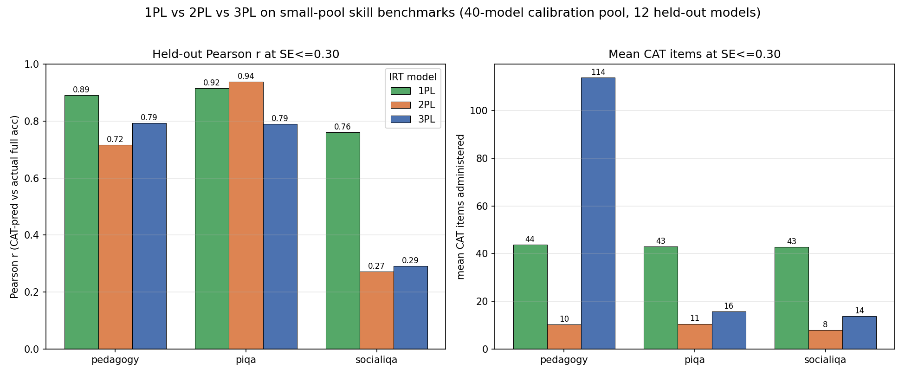
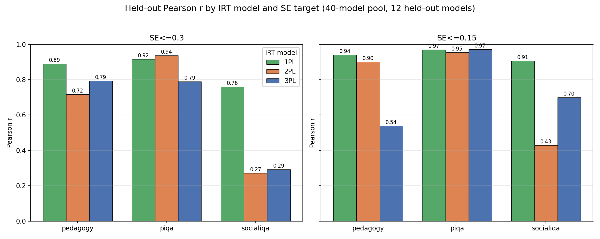

# Experiment 3: 1PL vs 2PL vs 3PL on three small-pool skill benchmarks

How does IRT model order (1PL / 2PL / 3PL) affect the SE-stopped CAT diagnostic
when the item bank is calibrated on only ~40 models? We run the full
calibrate -> CAT -> predict pipeline for **pedagogy**, **piqa**, and **socialiqa**
under all three models and compare held-out accuracy prediction.

**Headline:** at a 40-model calibration pool, **1PL (Rasch) is the most robust
model overall** — it is best or within ~0.02 of best on every benchmark, and it
is the *only* model that stays strong on socialiqa. **2PL** is the most
item-efficient and edges out 1PL on the clean, large piqa bank. **3PL collapses**
at this pool size (parameters pinned at their bounds, item counts explode,
correlation goes non-monotone in SE), consistent with the ARC small-pool result.
**socialiqa is weak under every model** — its bank barely separates these models.

## How to reproduce

CPU-local, no AWS, no network:

```bash
uv run python AdaptiveTesting/Research/01_MCQ_ATLAS/data/pedagogy_feasibility/pl_1_2_3_comparison/run_pl_comparison.py
```

Runtime is dominated by girth's `twopl_mml` on the larger banks (piqa 2PL ~5-6
min, socialiqa 2PL ~3 min); 1PL and the self-contained 3PL fit in seconds. The
run falls back to sequential automatically if the sandbox forbids a process pool.

## Method (everything held identical to the published 2PL diagnostic)

- **Data:** `AdaptiveTesting/Outputs/full200_results/Outputs/mcq/{bench}` — 52
  models per benchmark of per-item 0/1 correctness.
- **Split (byte-for-byte from `scripts/mcq_diagnostic.py`):**
  `load_benchmark(...).dropna()` then `numpy.default_rng(7).permutation`,
  `n_test = min(12, n_models // 3) = 12`, `test = sorted(order[:12])`,
  `train = order[12:]` (40 models). The same 40/12 split is used for all three
  models so the numbers are directly comparable.
- **Item filter:** `tutor_cat.mcq_irt.matrix.filter_items` on the **train** slice
  (ATLAS rules: drop all-pass / all-fail / low point-biserial items).
- **Calibration (reused fitters, not reimplemented):**
  - **1PL** — girth `rasch_mml` (discrimination fixed at 1).
  - **2PL** — girth `twopl_mml`.
  - **3PL** — the self-contained marginal-maximum-likelihood EM (Bock-Aitkin
    E-step, bounded Fisher-scoring M-step) in
    `scripts/se_sweep_small_pool.fit_3pl_mml`. girth's `threepl_mml` is broken
    under scipy>=1.15, so this is the working 3PL path. All three go through
    `se_sweep_small_pool.fit_bank`.
  - A uniform usability filter (finite, `a>0`, `0<=c<1`) is applied to every
    fitted bank. It is a no-op for 1PL/2PL here and — importantly — also drops
    nothing for 3PL, because the EM lower-bounds `a` at 0.01; 3PL degeneracy
    therefore shows up as **bounds-pinning**, not as dropped items.
- **CAT:** the c-aware EAP / Fisher-information CAT from `scripts/se_sweep.py`
  (`full_cat_traces` + `pred_meanprob`), `MIN_ITEMS=8`, stop at `SE <= target`.
  At `c=0` this reduces *exactly* to the 2PL/1PL CAT, so 1PL and 2PL reproduce
  the published numbers to 4 decimals (see validation).
- **Metrics (held-out, 12 models):** Pearson `r` and MAE of CAT-predicted vs
  **actual full-bank** accuracy, mean CAT items administered, and the kept
  (`a>0`) bank size. `frac_reached_se` is the fraction of the 12 models that
  actually hit the SE target before exhausting the bank.

## Validation (recomputed == published)

The 2PL rows reproduce `pedagogy_feasibility/mcq_diagnostic_summary.csv` and the
1PL pedagogy rows reproduce `pedagogy_feasibility/rasch_1pl/…summary.csv`
**exactly** (all 8 checks pass to 4 decimals):

| model | benchmark | SE | recomputed r | published r |
|---|---|---|---|---|
| 2PL | pedagogy  | 0.30 | 0.7163 | 0.7163 |
| 2PL | pedagogy  | 0.15 | 0.8996 | 0.8996 |
| 2PL | piqa      | 0.30 | 0.9373 | 0.9373 |
| 2PL | piqa      | 0.15 | 0.9536 | 0.9536 |
| 2PL | socialiqa | 0.30 | 0.2713 | 0.2713 |
| 2PL | socialiqa | 0.15 | 0.4296 | 0.4296 |
| 1PL | pedagogy  | 0.30 | 0.8903 | 0.8903 |
| 1PL | pedagogy  | 0.15 | 0.9407 | 0.9407 |

## Results

### SE <= 0.30 (primary operating point)

| benchmark | model | r | MAE | mean items | kept items | frac reached SE |
|---|---|---|---|---|---|---|
| pedagogy  | **1PL** | **0.890** | 0.101 | 43.8  | 318 | 1.00 |
| pedagogy  | 2PL     | 0.716 | 0.063 | 10.2  | 318 | 1.00 |
| pedagogy  | 3PL     | 0.793 | 0.206 | 113.8 | 318 | 0.67 |
| piqa      | 1PL     | 0.916 | 0.042 | 43.1  | 831 | 1.00 |
| piqa      | **2PL** | **0.937** | 0.040 | 10.6  | 831 | 1.00 |
| piqa      | 3PL     | 0.790 | 0.105 | 15.8  | 831 | 1.00 |
| socialiqa | **1PL** | **0.760** | 0.069 | 42.8  | 969 | 1.00 |
| socialiqa | 2PL     | 0.271 | 0.093 | 8.0   | 969 | 1.00 |
| socialiqa | 3PL     | 0.292 | 0.089 | 13.8  | 969 | 1.00 |

### SE <= 0.15 (tight)

| benchmark | model | r | MAE | mean items | kept items | frac reached SE |
|---|---|---|---|---|---|---|
| pedagogy  | **1PL** | **0.941** | 0.097 | 318.0 | 318 | 0.00 |
| pedagogy  | 2PL     | 0.900 | 0.080 | 275.5 | 318 | 0.17 |
| pedagogy  | 3PL     | 0.538 | 0.193 | 270.0 | 318 | 0.17 |
| piqa      | 1PL     | 0.970 | 0.042 | 194.2 | 831 | 1.00 |
| piqa      | 2PL     | 0.954 | 0.038 | 194.1 | 831 | 0.83 |
| piqa      | **3PL** | **0.972** | 0.066 | 38.5  | 831 | 1.00 |
| socialiqa | **1PL** | **0.906** | 0.073 | 182.6 | 969 | 1.00 |
| socialiqa | 2PL     | 0.430 | 0.080 | 14.3  | 969 | 1.00 |
| socialiqa | 3PL     | 0.699 | 0.074 | 425.6 | 969 | 0.67 |

Bold = best `r` per benchmark within each SE block. At `SE<=0.15` many runs never
reach the target and are capped at the full bank (`frac reached SE < 1`), so the
tight-SE rows mix "reached SE" with "ran out of items" and are less comparable
across models than the `SE<=0.30` rows.

### Figures

Grouped bars, Pearson `r` and mean CAT items at `SE<=0.30`:



Pearson `r` at both SE targets:



## Takeaways

- **1PL (Rasch) is the most robust at N=40.** It wins pedagogy and socialiqa
  outright at both SE targets, and is within ~0.02 of the best on piqa. It never
  collapses. If you must pick one model for small-pool skill banks, pick 1PL.
- **Per benchmark (SE<=0.30):** pedagogy -> **1PL** (0.890, vs 2PL 0.716);
  piqa -> **2PL** (0.937, and most item-efficient at ~11 items, with 1PL a close
  0.916); socialiqa -> **1PL** (0.760), the only model that works there.
- **2PL is the item-efficiency winner** (~8-11 items at SE<=0.30 vs ~43 for 1PL)
  and is the right call *only* on piqa, whose large, clean bank rewards
  per-item discrimination. On the noisier pedagogy/socialiqa banks its thin-pool
  discriminations hurt more than they help at loose SE.
- **3PL is not usable at this pool size.** Signs of collapse:
  - **Bounds-pinning** (fit_diagnostics.csv): `a` runs to the bounds `[0.01, 6.0]`
    and `c` to its `0.5` ceiling on *every* benchmark. Fraction of items with `a`
    pinned at a bound: pedagogy 215/318 (68%), piqa 382/831 (46%), socialiqa
    517/969 (53%); `c` pinned at the ceiling: 46 / 271 / 247 items respectively.
  - **Item explosion & non-convergence:** pedagogy 3PL needs 114 items at
    SE<=0.30 (vs 10 for 2PL) and only 67% of models reach the target.
  - **Non-monotone `r` in SE:** pedagogy 3PL *drops* 0.793 -> 0.538 going from
    SE<=0.30 to SE<=0.15 (tighter should not be worse); socialiqa 3PL swings
    0.292 -> 0.699 but at 426 items with only 67% reaching SE. The one place 3PL
    looks good (piqa SE<=0.15, 0.972) is on the bank where every model is
    well-separated anyway and is not reproducible on the weaker banks.
  - **MAE inflation** from the guessing floor `c` (pedagogy 3PL MAE 0.206 vs 2PL
    0.063). This mirrors the ARC small-pool finding: 3 free parameters per item
    on 40 persons is under-identified and destabilises.
- **socialiqa is weak under every model** (best is 1PL at 0.760 / 0.906). Its
  bank barely separates these 52 models, so no amount of model order rescues it;
  this is a property of the bank, not of the IRT model.

## Honest caveats

1. **Fitter mismatch is confounded with model order.** 1PL/2PL use girth MML
   (`rasch_mml` / `twopl_mml`); 3PL uses the self-contained Bock-Aitkin MML-EM
   because girth's `threepl_mml` is broken under scipy 1.17. So some of the
   1PL/2PL-vs-3PL gap could be estimator, not model order. This is unavoidable
   here, but it means "3PL is bad" should be read as "3PL *as we can fit it on
   CPU today* is bad," and the collapse is corroborated independently by the
   bounds-pinning.
2. **Tiny 40-model calibration pool.** 3PL has 3 free parameters per item; 40
   persons cannot identify them, hence the pinning/collapse. Even 2PL
   discriminations run large on thin data (here `a` up to 5.0, near girth's 6.0
   cap).
3. **Non-convergence / SE not reached.** At SE<=0.15 several models never reach
   the target and are capped at the full bank (`frac reached SE < 1`, e.g. all
   pedagogy 1PL runs). Tight-SE rows are therefore only loosely comparable across
   models; the SE<=0.30 block is the clean comparison.
4. **Predicted vs actual are on slightly different scales.** The predictor is the
   mean success probability over the *kept* bank; "actual" is mean accuracy over
   the *full raw* bank, and the 3PL guessing floor raises predicted accuracy.
   This inflates 3PL MAE even where rank agreement is fine, so **`r` is the
   headline metric**, not MAE.
5. **The CAT is identical across models.** All three share the same c-aware
   EAP/Fisher CAT (reducing to the 2PL/1PL CAT at `c=0`), so differences come
   from the calibrated bank, not the test-administration logic — and the 2PL/1PL
   numbers reproduce the published results exactly (validated above).

## Files

- `run_pl_comparison.py` — the single script that produces everything here.
- `pl_1_2_3_comparison.csv` — the combined deliverable table (benchmark x model x SE).
- `fit_diagnostics.csv` — per-fit bank size, `a`/`c` ranges, bounds-pinning counts, fit seconds.
- `per_model_predictions.csv` — per held-out model predictions (audit trail).
- `pl_comparison_se0.3.png` — grouped bars: `r` and mean items at SE<=0.30.
- `pl_comparison_r_by_se.png` — grouped bars: `r` at SE<=0.30 and SE<=0.15.
