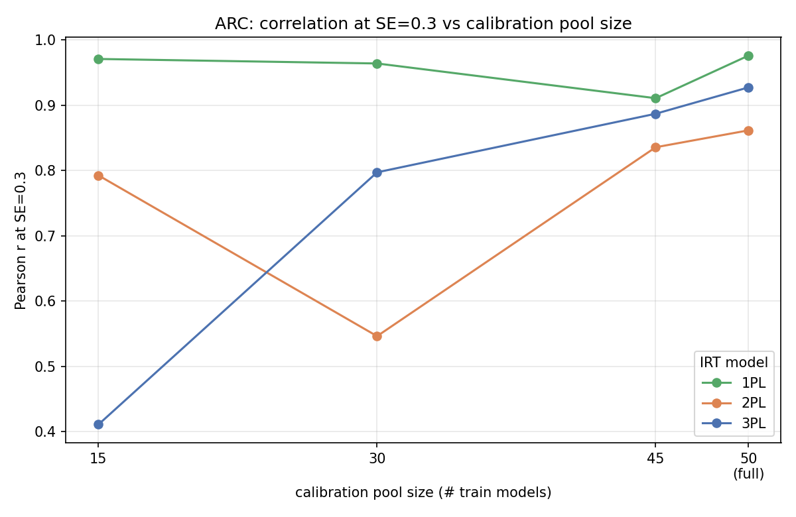
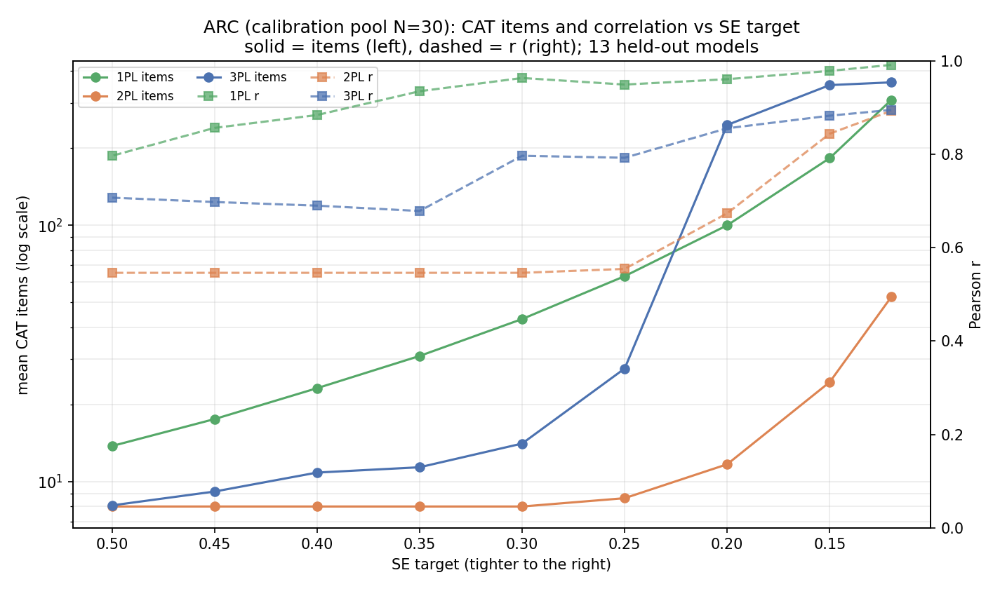

# SE sweep vs calibration-pool size (local ARC bank)

How the size of the *calibration pool* (number of train models the item bank is fit on)
changes the CAT items-vs-correlation tradeoff. This is the full-pool ARC SE sweep
(`../se_sweep/`, `se_sweep.py --source local`) re-run at several pool sizes, with everything
downstream of calibration held fixed: the **same** held-out test models (seed 7, `n_test 13`),
the **same** Fisher-information EAP CAT, the **same** SE grid
(0.5, 0.45, 0.4, 0.35, 0.3, 0.25, 0.2, 0.15, 0.12), and the **same** mean-probability IRT
predictor. The only thing that varies across runs is the number of TRAIN models.

Script: `../../scripts/se_sweep_small_pool.py`. Every correlation is Pearson r between the
CAT-predicted benchmark score and the true full-ARC accuracy on the 13 held-out models.

## Setup

- ARC-Challenge in-house matrix: **63 models**. Split (seed 7, `n_test 13`) -> **13 held-out
  test models** (fixed across every run) and a **full train pool of 50 models**.
- Pool sizes: full (**50**) plus fixed-seed random subsamples of the train models (seed 7).
  The requested **N=60 is not attainable** (the full train pool is only 50), so **N=45** is
  used as the near-full small pool; the comparison spans **N in {15, 30, 45, 50(full)}**.
- 1PL (girth `rasch_mml`) and 2PL (girth `twopl_mml`) reproduce the published local ARC bank
  **exactly** at the full pool (e.g. 2PL r=0.8615/8 items at SE<=0.3; 1PL r=0.976/43 items at
  SE<=0.3). girth's `threepl_mml` is broken under scipy>=1.15, so **3PL is fit with a
  self-contained marginal-maximum-likelihood EM** (Bock-Aitkin, Fisher-scoring M-step) on the
  same EAP quadrature. Bounds a in [0.01, 6], c in [0, 0.5] keep the thin-sample optimiser
  sane; parameters pinned at those bounds are reported as a degeneracy fingerprint.

## Correlation at SE<=0.3 vs calibration pool size

The headline: **fewer calibration models degrade 3PL first and worst, 2PL noisily, and 1PL
barely at all.** (`corr_at_se0.3_by_pool.csv`, `corr_vs_pool_se0.3.png`.)

| IRT model | N=15 | N=30 | N=45 | N=50 (full) |
|---|---:|---:|---:|---:|
| 1PL (Rasch)   | 0.971 | 0.964 | 0.911 | **0.976** |
| 2PL (girth)   | 0.793 | 0.546 | 0.836 | **0.862** |
| 3PL (MML-EM)  | 0.411 | 0.797 | 0.887 | **0.927** |



## Items and correlation vs SE at a small pool (N=30)

Dual axis (solid = mean CAT items, log left; dashed = Pearson r, right), one colour per model
type. (`se_sweep_small_pool_N30.png`.)



## Full-pool (N=50) vs small pools, at three SE targets

| Model | Pool | SE<=0.5 | SE<=0.3 | SE<=0.12 |
|---|---:|---|---|---|
| 1PL | 50 (full) | r=0.729 / 14 it | r=0.976 / 43 it | r=0.985 / 304 it |
| 1PL | 30        | r=0.797 / 14 it | r=0.964 / 43 it | r=0.992 / 308 it |
| 1PL | 15        | r=0.763 / 14 it | r=0.971 / 44 it | r=0.993 / 310 it |
| 2PL | 50 (full) | r=0.862 / 8 it  | r=0.862 / 8 it  | r=0.965 / 71 it  |
| 2PL | 30        | r=0.546 / 8 it  | r=0.546 / 8 it  | r=0.894 / 53 it  |
| 2PL | 15        | r=0.793 / 8 it  | r=0.793 / 8 it  | r=0.859 / 32 it  |
| 3PL | 50 (full) | r=0.845 / 8 it  | r=0.927 / 20 it | r=0.902 / 373 it |
| 3PL | 30        | r=0.707 / 8 it  | r=0.797 / 14 it | r=0.896 / 361 it |
| 3PL | 15        | r=0.359 / 8 it  | r=0.411 / 8 it  | r=0.708 / 104 it |

Usable (a>0) bank size shrinks with the pool for every model type -- 759 (N=50) -> 742 (45) ->
705 (30) -> 662 (15) -- because item filtering (drop all-pass/all-fail/low point-biserial)
removes more items when fewer models vary on them. No 2PL discriminations went <=0 (a in
[0.2, 5.0] at every pool), so the shrinkage is filter-driven, not fit-driven.

## Takeaways

- **1PL is the most robust to a small pool.** A single difficulty per item is estimable from
  as few as 15 models: r at SE<=0.3 stays 0.91-0.98 across all pool sizes and the whole
  items/correlation curve barely moves. The price is length -- 1PL needs ~43 items at SE<=0.3
  regardless of pool size.
- **3PL destabilises first and worst.** Correlation at SE<=0.3 falls monotonically
  0.93 -> 0.89 -> 0.80 -> 0.41 as the pool shrinks 50 -> 45 -> 30 -> 15. The guessing parameter is
  effectively unidentifiable with few models (c pinned at its bound for ~130 items at every
  pool; ~1/3 of items pin a at a bound), and at N=15 the 3PL is broken (r~0.4-0.5 until you
  spend 100+ items). Its guessing floors also lower Fisher information, so tightening SE below
  ~0.3 *explodes* test length (200-370 items at the full pool) while correlation drops -- the
  opposite of the intended tradeoff.
- **2PL is intermediate but noisy.** Thin-pool discriminations are unstable, giving a
  non-monotone correlation-vs-pool (0.79 at N=15, dipping to 0.55 at N=30, recovering to 0.86
  at full). It keeps the short-test advantage (~8 items until SE<0.25) but the short-test
  correlation cannot be trusted at small N.
- **MAE rises at small pools** for every model (e.g. 1PL MAE 0.05 -> 0.12 from full -> N=15).
  Part of this is a fixed offset (the predictor is a mean over the *kept bank*, the target is
  accuracy over *all* ARC items) that grows as the bank sparsifies; 3PL MAE is uniformly high
  (~0.13) because the guessing floor inflates predicted accuracy. Correlation is the fair
  cross-condition metric; MAE would need a per-bank linear recalibration to compare.

**Practical guidance:** with a small calibration pool (<=30 models) prefer 1PL (Rasch) -- it
degrades gracefully and holds r~0.95+ at SE<=0.3. Avoid 3PL below ~45 models. 2PL is usable
but verify, since its thin-sample discriminations are noisy.

## Files

- `se_sweep_small_pool_combined.csv` -- main results: `model_type, n_pool, se_target,
  mean_items, corr, mae, n_bank_items` (3 model types x 4 pools x 9 SE targets).
- `corr_at_se0.3_by_pool.csv` -- correlation at SE<=0.3 pivoted by model type x pool size.
- `fit_diagnostics.csv` -- per (model, pool): kept/usable item counts, a/c ranges, count of
  parameters pinned at a bound (3PL degeneracy fingerprint), and fit time.
- `se_sweep_small_pool_N30.png` -- items + correlation vs SE at the N=30 pool (dual axis).
- `corr_vs_pool_se0.3.png` -- correlation at SE<=0.3 vs pool size, one line per model type.

## Reproduce

```bash
export REPO=/Users/arhant/Documents/EDLM/olmo-eval-full
export PYTHONPATH=$REPO/eduLLM-Evals
uv run python $REPO/AdaptiveTesting/Research/scripts/se_sweep_small_pool.py \
  --mcq-dir $REPO/AdaptiveTesting/Inputs/Open/LLM-Judge/mcq --bench arc_challenge \
  --pools 15,30,45 --workers 4 \
  --out-dir $REPO/AdaptiveTesting/Research/01_MCQ_ATLAS/data/se_sweep_small_pool
```

`--workers` uses a small process pool where the OS permits it and falls back to sequential
otherwise (~13 min sequential; the girth 2PL fits dominate). Held-out test set and SE grid are
identical to `../se_sweep/`, so rows are directly comparable to the full-pool baseline there.
