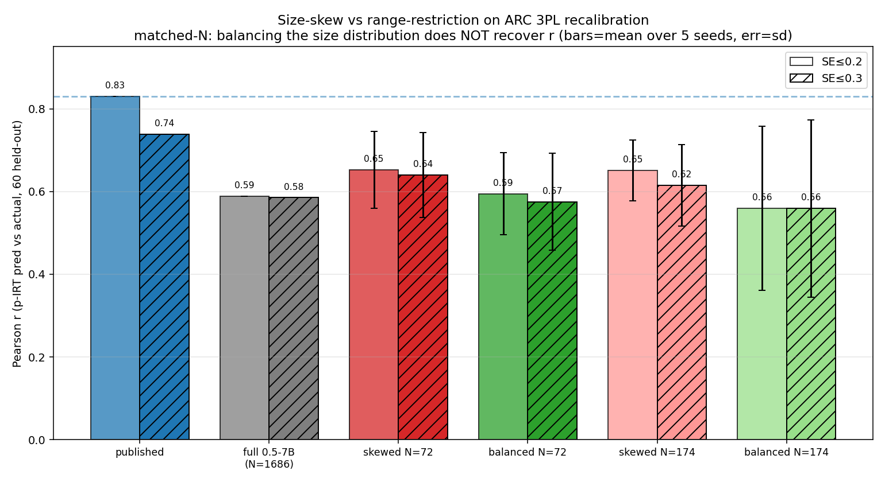

# Size-skew-controlled ARC 3PL recalibration (GAPS #9)

Isolates **range-restriction** from **size-skew** in the section-1 result. Section 1
shows: published ATLAS 3PL bank (thousands of models, wide param range) → held-out
r=0.830@SE0.2; the SAME bank refit on only the 0.5–7B pool → r≈0.589. GAPS #9 flags
that the 0.5–7B pool is ~95% 7B, so that drop conflates (a) restricting the parameter
**range** and (b) a size-**skewed**, thin calibration pool. Here we hold N fixed and
vary **only** the size distribution.

Method: reuse ATLAS's exact pipeline — chunked `mirt` 3PL EM + mean–σ linking
(`../../../scripts/recal_fit_link.r`, a dynamic-chunk merge of ATLAS's
`01_fit_irt_custom.r` + `02_link_chunks_custom.r`) — then the identical held-out
Fisher-information CAT + p-IRT reconstruction on the **same 60 held-out models**
(`atlas_recalibrate_0p5_7b/atlas_diagnostic_validation.py`), SE targets 0.2 / 0.3,
5 seeds. Driver: `../../../scripts/size_balanced_recal.py`.

## Size histogram of the 0.5–7B pool (1,686 models)

| band | models | % |
|---|---:|---:|
| [0.5,1) | 0 | 0.0% |
| [1,2) | 3 | 0.2% |
| [2,3) | 60 | 3.6% |
| [3,5) | 11 | 0.7% |
| [5,7] | 1,612 | 95.6% |

Confirms GAPS #9: the pool is **95.6% 7B** and extremely thin below 5B (only 14
models under 2B; 74 under 5B). A fully uniform 5-band pool is capped by the scarcest
band ([1,2)=3) → only 12 models, far too thin to fit a 3PL. So we balance at the
coarsest levels that keep a usable N:

- **3-band** `{<3B, 3–<7B, 7B}` — cap = 24/band → **N=72**, 33% 7B (spreads across the range).
- **2-band** `{<7B, 7B}` — cap = 87/band → **N=174**, 50% 7B (de-skews 7B dominance at larger N).

Each balanced pool is compared to a **size-skewed** pool = a random draw from the full
1,686-model roster (≈95% 7B) at the **same N**. The only difference is the size mix.

## Matched-N comparison (mean ± sd over 5 seeds, 60 held-out models)

| Pool | N_cal | % 7B | SE | r | MAE | mean items |
|---|---:|---:|---:|---:|---:|---:|
| **Published ATLAS bank** (ref, §1) | ~1000s | wide | 0.2 | **0.830** | 0.147 | 21.1 |
| **Published ATLAS bank** (ref, §1) | ~1000s | wide | 0.3 | **0.738** | 0.172 | 9.9 |
| Full 0.5–7B (ref, §1) | 1,686 | 95.6% | 0.2 | 0.589 | 0.147 | 12.5 |
| Full 0.5–7B (ref, §1) | 1,686 | 95.6% | 0.3 | 0.585 | 0.150 | 8.3 |
| Skewed, matched | 72 | ~95% | 0.2 | 0.652 ± 0.092 | 0.130 | 8.8 |
| Skewed, matched | 72 | ~95% | 0.3 | 0.640 ± 0.103 | 0.132 | 8.3 |
| **Balanced (3-band)** | 72 | 33% | 0.2 | **0.594 ± 0.099** | 0.106 | 8.9 |
| **Balanced (3-band)** | 72 | 33% | 0.3 | **0.575 ± 0.117** | 0.108 | 8.3 |
| Skewed, matched | 174 | ~95% | 0.2 | 0.651 ± 0.074 | 0.139 | 11.3 |
| Skewed, matched | 174 | ~95% | 0.3 | 0.615 ± 0.098 | 0.147 | 8.5 |
| **Balanced (2-band)** | 174 | 50% | 0.2 | **0.560 ± 0.198** | 0.114 | 11.4 |
| **Balanced (2-band)** | 174 | 50% | 0.3 | **0.559 ± 0.214** | 0.117 | 8.9 |

Source of truth: `results.csv` (one row per pool/SE/seed), `summary.csv`, figure
`size_balance_r_comparison.png`.



## Verdict

**It is range-restriction (parameter-window / overall pool character), NOT size-skew.**
De-skewing the pool from ~95% 7B down to 33–50% 7B at matched N does **not** move r
toward 0.83 — the size-balanced pools land at r≈0.56–0.59, statistically
indistinguishable from (and if anything slightly *below*) the size-skewed pools at the
same N (r≈0.65), and right on top of the full 0.5–7B result (0.589). Pool *count* also
doesn't matter (skewed r≈0.65 at N=72, N=174, and 0.589 at N=1,686 are all the same):
the bottleneck is the restricted 0.5–7B parameter range, not how the pool is composed
within it. The one thing balancing buys is lower accuracy **MAE** (0.11 vs 0.13 — small
models improve absolute-accuracy calibration) but it costs rank-correlation stability
(2-band sd blows up to ~0.20 because scarce sub-2B models add noise). Balancing does not
recover the published bank's discrimination.

## Reproduce

```bash
export REPO=/Users/arhant/Documents/EDLM/olmo-eval-full
uv run python $REPO/AdaptiveTesting/Research/scripts/size_balanced_recal.py
```

Per-pool calibration logs and cached linked-param banks are under `_work/cache/`.
