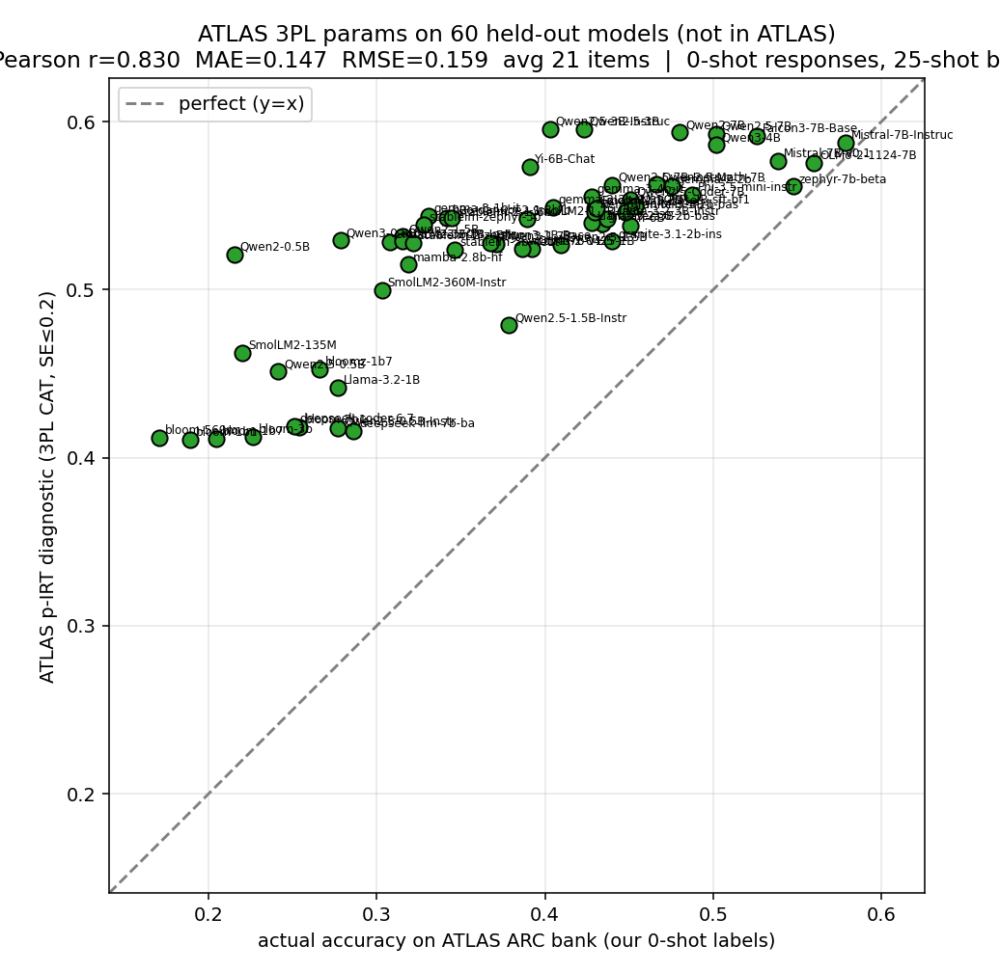
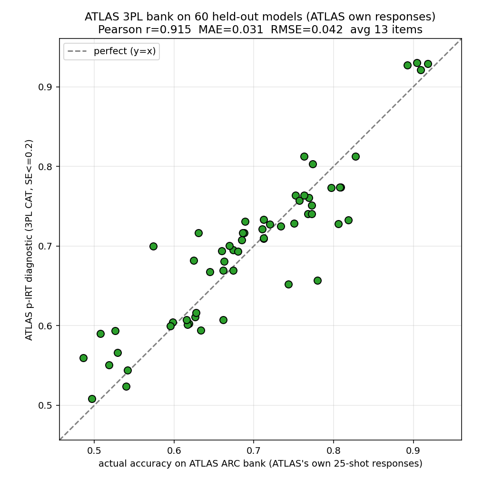
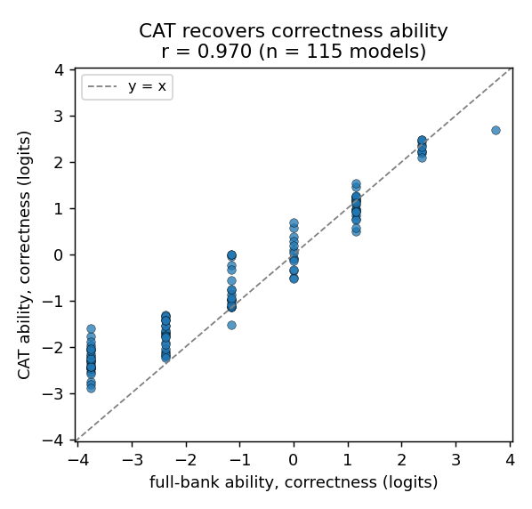
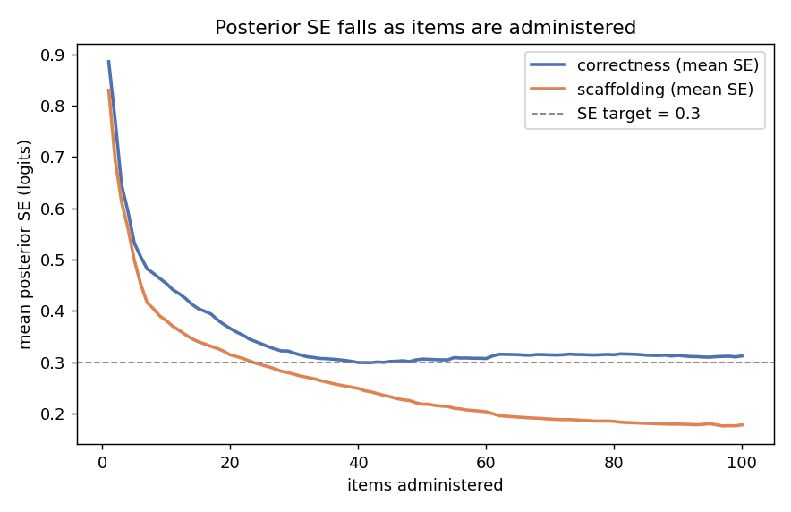

# CAT for Accelerated Pedagogy Benchmarking

## Abstract

Benchmarking and evaluation take an estimated 10–15% of total model training time (OLMo-3, Llama). Fast, granular, trustworthy benchmarking is crucial for EDU-LLM given the number of novel hypotheses tested. We propose a skill-based Computerized Adaptive Test (CAT) that reduces the items needed to report a predicted per-skill accuracy while holding precision close to full-length benchmarks. Findings split between Multiple Choice (MCQ) and Free Response (FRQ) benchmarks.

- MCQ. We reproduce ATLAS-style adaptive testing on ARC: using the published ATLAS 3PL bank, CAT recovers full benchmark accuracy at r = 0.83 with under 2% of items (~21 of 1,172 at SE ≤ 0.2); a range-restricted 0.5–7B refit is weaker (r = 0.59).
- FRQ. We grade responses with an LLM-as-judge against per-scenario rubrics to build a criterion-level response matrix, derive a Q-matrix, and fit 2PL/MIRT so CAT selects scenarios adaptively.
## 1. MCQ

### 1.1 Strategy

Our work builds on ATLAS, which showed adaptive testing can dramatically reduce the items required to predict benchmark accuracy. Items calibrated with Item Response Theory (IRT) also provide information beyond accuracy: models that get harder questions right and miss easy ones are ranked appropriately under CAT, which a simple accuracy comparison cannot capture.

We show the feasibility of recreating the ATLAS methodology on new benchmarks and formalize the requirements to use CAT as a true MCQ benchmark replacement, highlighting the promises and shortcomings of MIRT for MCQ — a discussion largely missing from ATLAS.

### 1.2 ATLAS Recreation

There is a gap between ATLAS results and evaluations during model training. Applying IRT calibration to a benchmark without public response data requires analyzing the upfront cost to reach a target correlation, and the ability to discriminate models across parameter ranges without many calibration models was not explicitly shown. Two feasibility experiments follow: calibration on a skill-based benchmark lacking public responses, and calibration on subsets of ATLAS data mimicking real-world model diversity, count, and parameter-range trade-offs. Inference used L4 GPUs (CPUs parallelized model downloads).

Concretely, on ARC we run ATLAS-style CAT two ways on the same 60 held-out models: the published ATLAS 3PL bank vs. the pipeline refit on only the 0.5–7B slice. r is Pearson between CAT-predicted and true full-benchmark accuracy.

| Condition | SE stop | Pearson r | MAE | Mean CAT items |
|---|---|---|---|---|
| Published ATLAS 3PL bank | ≤ 0.2 | 0.830 | 0.147 | 21.1 |
| Published ATLAS 3PL bank | ≤ 0.3 | 0.738 | 0.172 | 9.9 |
| Refit on 0.5–7B models | ≤ 0.2 | 0.589 | 0.147 | 12.5 |
| Prompt-matched (ATLAS own resp.) | ≤ 0.2 | 0.915 | 0.031 | 13.0 |

*Table 1. ATLAS 3PL transfer on held-out ARC models (integrated from 01_MCQ_ATLAS).*

*Figure 1. Published ATLAS 3PL bank on 60 held-out ARC models (SE ≤ 0.2): r = 0.83, ~21 items.*

*Figure 2. Prompt-matched responses: r = 0.91, MAE = 0.031 in ~13 items — most earlier degradation was scoring-protocol mismatch, not IRT transfer.*

### 1.3 Recommendations

- Open response resources are useful but limited; choose the parameter range appropriately.
- 1PL/2PL matters more when fewer calibration models are available; adjust the standard error to match accuracy requirements; model diversity is important.
- Inference is a significant upfront cost, but it speeds up on-demand evaluation and unlocks benchmarking during checkpoints.
## 2. FRQ

### 2.1 LLM-as-Judge

Prometheus 2 had been used without proving its judgments matched human graders. We graded three tutor responses for each of 10 scenarios against their criteria (261 binary response–criterion cases), targeting Macro-F1 ≥ 0.80, critical-failure sensitivity ≥ 0.9, per-skill F1 ≥ 0.70, repeat agreement ≥ 0.90, and prompt-flip rate ≤ 0.10. Judges were blinded to human labels and tutor identity; local judges ran six waves (three identical runs plus whitespace, header, and politeness prompt variations). Parsing failures were separated from grading errors, and Qwen's disagreements were reviewed by hand.

No judge passed every threshold, and frontier judges (limited to 174 cases each, barred from their own provider family) performed similarly without clearing every bar. We froze Qwen/Qwen3.5-9B zero-shot binary judging, one criterion at a time, evidence required, p_fail ≥ 0.33 = fail — the strongest, most stable local candidate, self-hostable with a frozen checkpoint for reproducibility, privacy, and low marginal cost across the hundreds of thousands of judgments needed.

### 2.2 Skills and Rubrics

MIRT needs a set of skills and a Q-matrix recording the skills each criterion tests. An LLM proposes each 1 with evidence, an explanation, and a counterfactual; labels are reassessed by two LLM verifiers and, on a subset, two human reviewers, keeping positive labels only on unanimous agreement. Benchmarks: TutorBench (662 scenarios, 6,462 criteria across content, diagnosis, scaffolding), TutorEval (828 scenarios; conceptual and quantitative), WildBench (1,001 scenarios, 11 capability tags), EduBench (nine deterministically-verified task types), and Bridge (642 scenarios, 39 rubric templates, five skills).

### 2.3 Feasibility

For calibration, 82 open models under 7B answer all 662 TutorBench scenarios on a single L4 GPU, and the frozen judge grades each answer criterion by criterion; a second run of 52 models overlaps the first by 19. The smallest models fall into repetitive loops the judge marks unscorable, and long inputs are capped at 32k tokens (near-complete coverage).

| Parameter Range (B params) | Avg. Inference Time on L40S GPU (s) |
|---|---|
| 0 – 1 | 4 |
| 1 – 2 | 10 |
| 2 – 5 | 19 |
| 5 – 7 | 34 |

*Table 2. Inference cost for tutor models.*

### 2.4 MIRT Results — TutorBench

Skills: correctness (factually true information and accurate diagnosis) and scaffolding (framework/hints that advance the student without giving the answer); presentation (Markdown/LaTeX, second-person, convention) is a third skill in the 3-skill model. Content and diagnosis were collapsed into correctness due to collinearity. Choice factors: number of skills (1/2/3) and estimator (Gaussian vs. Batch EAP vs. MWLE). Ideal conditions: 115 models (0.1B–7B), 2-skill, Batch EAP/MWLE, trace (Fisher) selection, presentation reported separately. Metrics use the out-of-sample correlation R and slope against the full-bank EAP; total SE combines posterior SE with parameter uncertainty; seed stability ≈ 0.15.

*Minimum-scenario floor (2-skill, in sample):*

| Min scenarios | Correctness MWLE r | Scaffolding MWLE r | Corr. MWLE slope | Scaff. MWLE slope | Scenario mean |
|---|---|---|---|---|---|
| 0 | .9815 | .9419 | 1.006 | 1.085 | 21.5 |
| 12 | .9819 | .9457 | 1.002 | 1.090 | 21.9 |
| 15 | .9822 | .9481 | 1.000 | 1.087 | 22.5 |
| 20 | .9822 | .9526 | 1.007 | 1.093 | 24.0 |

*Table 3. Minimum-scenario floor vs. recovery (chose 12).*

| Estimator | Corr. Slope | Corr. R | Scaff. Slope | Scaff. R |
|---|---|---|---|---|
| Gaussian | .644 | .921 | .875 | .903 |
| Batch EAP | .755 | .939 | .918 | .913 |
| MWLE | .981 | .945 | 1.032 | .902 |

*Table 4. Estimator comparison (2-skill).*

| Model | Correctness r | Scaffolding r | Presentation r | Precision | Mean scenario |
|---|---|---|---|---|---|
| 1 skill | .949 | N/A | N/A | 115/115 | 12.1 |
| 2 skill | .945 | .902 | N/A | 115/115 | 21.9 |
| 3 skill | .969 | .916 | .965 | 58/115 | 41.2 |

*Table 5. Skill-count comparison.*

| Skill | MWLE R | MWLE Slope | SE Post | SE Total |
|---|---|---|---|---|
| Correctness | 0.945 | 0.981 | 0.334 | 0.412 |
| Scaffolding | 0.902 | 1.032 | 0.307 | 0.359 |

*Table 6. Recovery and uncertainty (2-skill).*

*Figure 3. 2-skill correctness recovery, 115-model fit (in-sample EAP r = 0.97; out-of-sample MWLE 0.945 in Table 6).*

*Figure 4. Posterior SE falls with items administered, crossing the SE = 0.3 target for both skills.*

With the finalized 2-skill 2PL model calibrated on 115 models (0.1B–7B), trace selection, SE target 0.30, and a minimum-scenario floor of 12, all 115/115 models reach the target in about 22 scenarios. It recovers correctness at out-of-sample r = 0.94 and scaffolding at 0.91, with slopes 0.981 and 1.032 — a roughly 30x reduction that nearly matches the full-bank grade in distribution and scale. Accounting for item-parameter uncertainty, total SE runs slightly high (0.412 correctness, 0.359 scaffolding).

*Limitations.*

- Parameter SE estimated on 115 models is added into every skill-estimate SE; more calibration models would reduce it from ~0.2 on average.
- The judge is imperfect and does not always agree with human graders; with only 115 models the scale compresses and weak models pull toward the mean (partially mitigated by MWLE).
- Parameter-SE references: Tsutakawa & Johnson (1990), Psychometrika 55(2), 371–390; Patton, Cheng, Yuan & Diao (2013), Applied Psychological Measurement 37(1), 24–40.
### 2.5 MIRT Results — TutorEval

TutorEval uses the ‘question’ field as scenarios (with textbook excerpts for open-book items) and splits ‘key points’ into criteria; 52 open-source models (0.2B–7B) calibrated discrimination/difficulty. CAT stops at SE < 0.3 with a 15-criteria minimum. Both unidimensional and 2D (conceptual, quantitative) were tried.

| Estimator | Conceptual Slope | Conceptual R | Quant. Slope | Quant. R |
|---|---|---|---|---|
| Gaussian | 0.43 | 0.8506 | 0.75 | 0.9572 |
| Batch EAP | 0.573 | 0.9063 | 0.846 | 0.9739 |
| MWLE | 0.67 | 0.9122 | 0.936 | 0.9721 |

*Table 7. TutorEval, two-dimensional.*

| Estimator | Ability Slope | Ability R |
|---|---|---|
| Gaussian | 0.545 | 0.9051 |
| Batch EAP | 0.659 | 0.9349 |
| MWLE | 0.686 | 0.9309 |

*Table 8. TutorEval, unidimensional.*

- The 2D model collapses back to unidimensional (skills correlate 0.98); we keep unidimensional for this benchmark (both shown for completeness).
- Reduction — unidimensional: ~10.4 scenarios (~80x), ~15 criteria (>100x from 1,786). 2D: 18.3 (trace) / 27.8 (D-opt) scenarios (~40x), ~34 criteria.
- Recovery — unidimensional MWLE r = 0.931; 2D MWLE r = 0.912 (conceptual) / 0.972 (quantitative). MWLE has the least score shrinkage.
- Limitation: 52 models is relatively minimal; more would strengthen validity.
## Appendix A. IRT Calibration Fundamentals (Unidimensional)

IRT calibrates per-item parameters that let CAT distinguish a model's ability. In the unidimensional case each model has a single latent ability θ, and each item is a sigmoid in the probability of a correct response given θ. The difficulty βᵢ sets the boundary θ; the discrimination αᵢ sets its steepness, giving the 2PL item response function:

\[ P(y=1\mid\theta,\beta_i,\alpha_i)=\frac{\exp[\alpha_i(\theta-\beta_i)]}{1+\exp[\alpha_i(\theta-\beta_i)]}=\frac{1}{1+\exp[-\alpha_i(\theta-\beta_i)]} \]

Calibration (EM) assumes each model's ability is normal with mean 0, discretizes θ over a range, and for each model computes the likelihood of its response pattern at each θ, multiplying by the prior to update the latent distribution. For each item, R(θ)/N(θ) — expected fraction correct at each θ — gives the points the sigmoid must fit, and item parameters are updated by logistic regression; the steps repeat until convergence.

