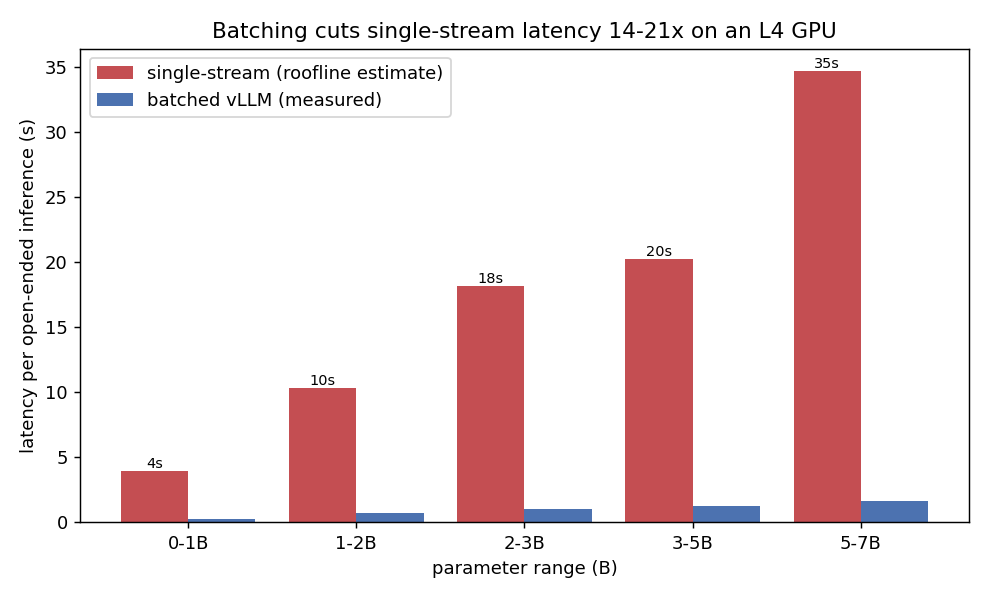

# Inference cost by task type and model size

We measured per-request latency for the full200 candidate models and converted it to
dollars. MCQ and open-ended tasks are reported separately, and open-ended is split into
three input-token buckets.

## Cost basis

- Hardware: g6.xlarge, one NVIDIA L4, on-demand us-east-1 at $0.8048/hr. This is the GPU
  the full200 inference ran on.
- `cost_per_inference_usd = latency_s * 0.8048 / 3600`. `cost_per_1k_usd` is that times 1000.
- We keep raw `mean_latency_s` and `median_latency_s` so cost can be rescaled to any other
  GPU price without re-measuring.
- Latency is per-request wall time under batched vLLM at temperature 0, so it reflects
  effective throughput cost, not single-stream latency.

## Data sources

- Open-ended (measured): 52 models across 6 benchmarks (biggen, bridge, infobench,
  tutorbench, tutoreval, wildbench), 206,307 inferences with per-item prompt tokens, output
  tokens, and latency. The 6 benchmarks are pooled and grouped per (model, bucket).
- MCQ (measured): the generative MCQ sweep. 24 models finished (benchmark `cdpk_main`, 25
  items each) and are used here. The full200 MCQ benchmarks (pedagogy, piqa, socialiqa) are
  loglikelihood scored and record no latency, so they cannot give a cost per inference. That
  is why this separate run exists.

Open-ended input buckets are cut at the tertiles of the prompt-token distribution (p33
about 117, p66 about 530): Short is under 128 input tokens (75,484 inferences), Medium is
128 to 511 (58,592), and Long is 512 or more (72,231).

## Result 1: cost per inference by task and input length

MCQ costs about $0.009 per 1,000 inferences. Open-ended costs about $0.20 to $0.23,
roughly 20x to 25x more.

| Task | Cost per 1k inferences |
|---|---|
| MCQ (cdpk_main, 24 models) | ~$0.009 |
| Open-ended, Short input | ~$0.20 |
| Open-ended, Medium input | ~$0.21 |
| Open-ended, Long input | ~$0.23 |

Numbers are the mean across models. Output tokens drive open-ended cost, not input length:
the three input buckets differ by only about 15% from Short to Long because decode
dominates. MCQ is cheap because the generated answer is a few tokens, so there is almost no
decode. MCQ and open-ended use different item sets and model sets, so compare them only by
order of magnitude.

Data: `data/mcq_cost_per_inference.csv`,
`data/open_ended_cost_per_inference_by_token_bucket.csv`.

## Result 2: single-stream latency by parameter size

For each size band we report measured mean prompt and output tokens, the measured batched
per-request latency, and an estimated single-stream latency from a memory-bandwidth decode
roofline (L4 at 300 GB/s, 60% efficiency, 2 bytes per param).

| Parameter range | Single-stream latency (s) | Batched latency (s) | Batch speed-up | Mean output tokens |
|---|---:|---:|---:|---:|
| 0-1B | 4.0 | 0.25 | ~16x | 878 |
| 1-2B | 10.3 | 0.74 | ~14x | 648 |
| 2-5B | 19.7 | 1.13 | ~17x | 658 |
| 5-7B | 34.7 | 1.64 | ~21x | 489 |

The single-stream figures (about 4, 10, 20, and 35 s) are the values in the outline's
tutor-cost table. In production the full200 inference ran batched, so measured per-request
time is 0.25 to 1.6 s. The single-stream figures are an L4 roofline estimate, not a direct
measurement, and an L40S (about 864 GB/s) would decode about 2x to 3x faster.

Data: `data/individual_latency_by_param_range.csv`.
