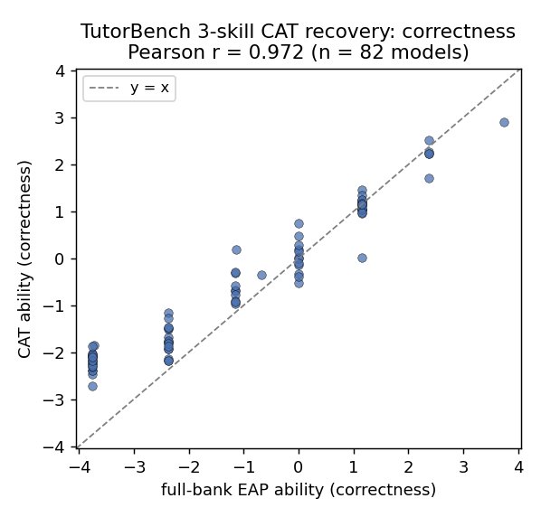
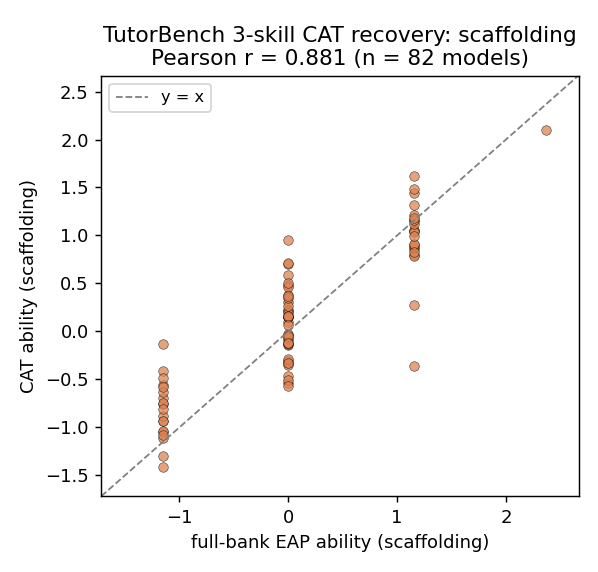
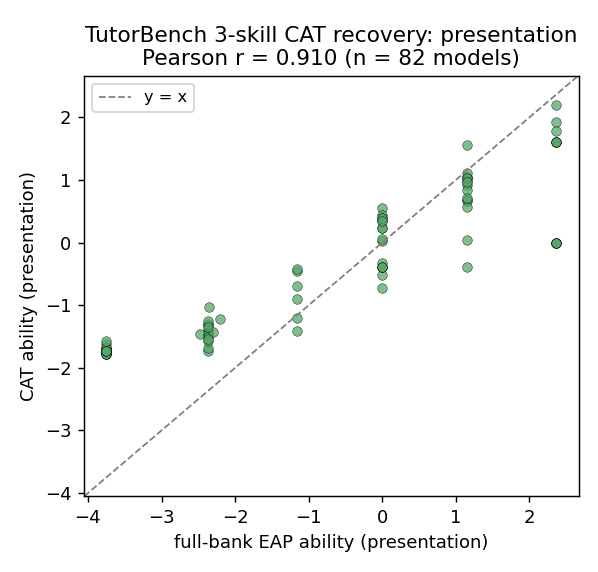
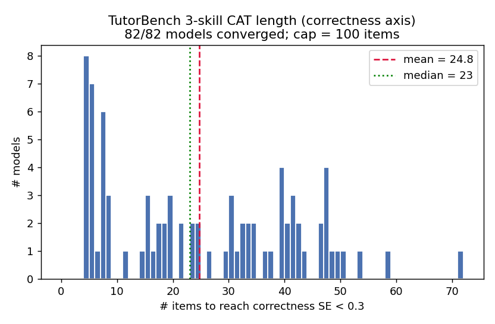
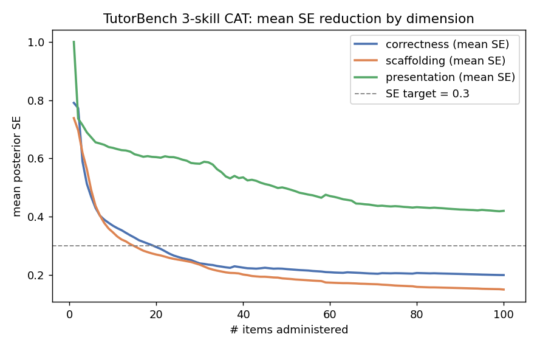
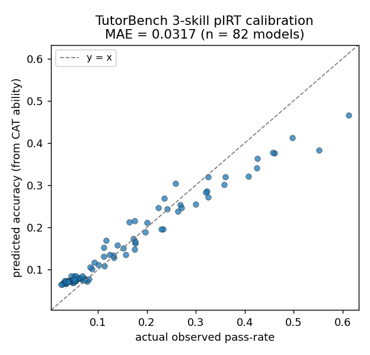
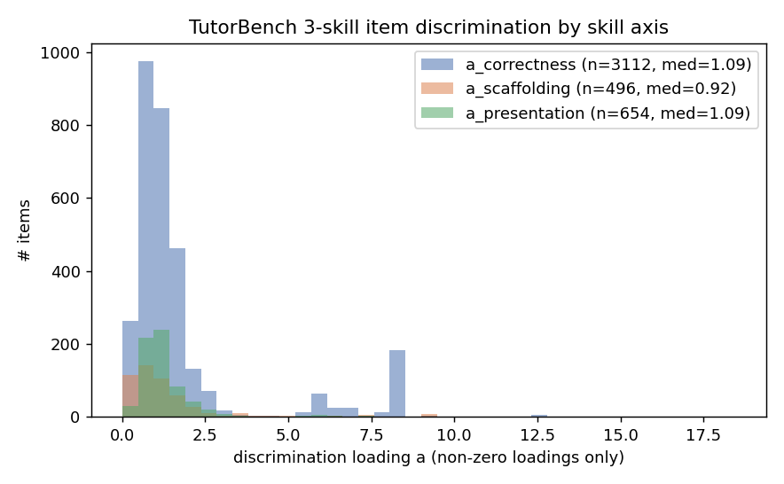
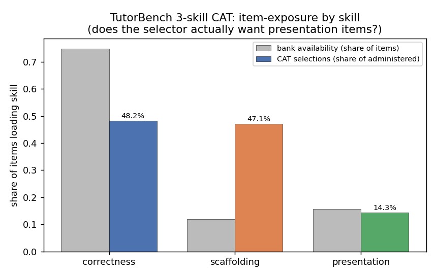

# CAT Evaluation — TutorBench 3-skill (correctness, scaffolding, **presentation**)

**Status:** READ-ONLY empirical CAT eval (NO params written; bank, fitters, curated data untouched; `--write-params` NOT used; nothing committed). Deliverables under `staging/cat_eval_3skill/` and copied to the TRACKED `reports/cat_eval_3skill/`.
**Date:** 2026-07-30
**Purpose:** Decide empirically whether the **presentation** axis carries *incremental* value in a Computerized Adaptive Test (recovery + independent information) — before deciding whether to freeze it — by running a FULL CAT eval over all 82 models that MIRRORS the definitive 2-skill CAT eval (`scripts/cat_eval_tutorbench.py` + `reports/cat_eval/`) so results are directly comparable.
**Method:** New `scripts/cat_eval_tutorbench_3skill.py` (2-skill script generalised to a 3-vector ability; the existing 2-skill script is untouched). EAP over the 3-D Gauss–Hermite grid, multidimensional Fisher-info next-item selection, exact MIRT Newton/Laplace update (`tutor_cat.mirt.update`), stop when ALL per-dim SEs < 0.3 (min-items 1, max-items 100, seed 20260730). Item bank = **Run 6's** fitted full 3-dim params (`staging/run6_presentation/calibration_mirt.csv`, 4,156 items; slot-repurposed `a_content→a_correctness`, `a_diagnosis→a_scaffolding`, `a_scaffolding→a_presentation`) — **not re-fit.** Matrix = `staging/response_matrix_full.csv` (82 × 6,845, includes presentation). OOS = k=5 3-skill fold-trained params (seed 20260729, same protocol as `staging/kfold_full`), generated read-only under `staging/kfold_full_3skill/` because Run 6 saved stability but not per-fold param CSVs.

---

## TL;DR — presentation is a genuine, independently-recoverable CAT axis, **not** redundant with correctness

- **Presentation recovers *better* than scaffolding** — the axis already in the instrument. Recovery r: presentation **0.910 in-sample / 0.822 OOS** vs scaffolding **0.881 / 0.758**. It is a well-measured axis, not noise.
- **Under CAT, presentation is materially LESS collinear with correctness than the person-level latent implied.** CAT-ability r(presentation, correctness) = **0.810** in-sample (0.818 OOS) — well below Run 6's latent **0.945** and the full-bank EAP **0.936**. The "presentation just tracks correctness" hypothesis is **not** supported at the ability level a CAT actually estimates: the adaptive test extracts distinct presentation information.
- **The selector actually *wants* presentation items.** Item-exposure share during adaptive testing: presentation **14.3%** of administrations vs **15.7%** bank availability (**0.91×** — near-proportional, not dominated out). Correctness is *under*-selected (0.64× its availability; its many easy items carry little info); scaffolding items are *over*-selected (≈3.9×; scarce but highly informative / multi-loading).
- **Adding presentation did not hurt the core axes — it slightly helped.** vs the 2-skill run: correctness recovery **+0.012 in / +0.035 OOS**; scaffolding **+0.032 in / +0.045 OOS**.
- **The one real cost is test length.** Pinning presentation to SE<0.3 is expensive: only **30/82** models converge on presentation within the 100-item cap (mean 40, median 37 items), and presentation is the binding constraint that pushes *overall* CAT length to **48.6 items** (2-skill: 23.6). Demanding SE<0.3 on presentation roughly **doubles** the test.
- **Verdict: presentation is a USEFUL independent CAT axis (not effectively redundant with correctness).** Consistent with Run 6's statistical case. Admit it as a 3rd (optional) axis; the practical lever is its SE/item budget, not its validity. Confirm loadings at N≥150.

---

## 1. Summary table (reference-shaped; mirrors `reports/cat_eval/cat_summary_table.md`)

| Benchmark | Models | Items kept (fit_block / total) | Bank (healthy / needs refit) | a median | Recovery r | CAT items | pIRT MAE |
|---|---|---|---|---|---|---|---|
| TutorBench (3-skill, overall) | 82 | 4156 / 6845 | correctness healthy / scaffolding needs refit / presentation stable | corre 1.09 / scaff 0.92 / prese 1.09 | corre 0.972 / scaff 0.881 / prese 0.910 | 48.6 (median 42; 30/82 conv.) | 0.0317 |
|   - correctness | 82 | 3112 loading | healthy | 1.087 | 0.972 | 24.8 (median 23; 82/82 conv.) | 0.0317 (overall) |
|   - scaffolding | 82 | 496 loading | needs refit | 0.923 | 0.881 | 16.9 (median 12; 82/82 conv.) | - |
|   - presentation | 82 | 654 loading | stable | 1.091 | 0.910 | 40.0 (median 37; 30/82 conv.) | - |

**Out-of-sample (k-fold fold-trained 3-skill params):** recovery r — correctness **0.887**, scaffolding **0.758**, presentation **0.822**.

> "Items kept / loading" counts strictly-positive fitted discrimination (`a>0`), matching the 2-skill script's convention. Run 6's memo counts *nonzero* (q==1) loadings: correctness 3,160, scaffolding 796, presentation 656 — the scaffolding gap (796 nonzero vs 496 positive) is ~300 loadings fitting **negative**, the known scaffolding instability, not a presentation issue. Presentation is clean: 656 nonzero → 654 positive.

---

## 2. Side-by-side vs the definitive 2-skill CAT run

| Metric | 2-skill (`reports/cat_eval`) | 3-skill (this run) | Δ (3 − 2) |
|---|---:|---:|---:|
| Recovery r — correctness (in-sample) | 0.960 | 0.972 | **+0.012** |
| Recovery r — correctness (OOS) | 0.852 | 0.887 | **+0.035** |
| Recovery r — scaffolding (in-sample) | 0.850 | 0.881 | **+0.032** |
| Recovery r — scaffolding (OOS) | 0.713 | 0.758 | **+0.045** |
| Recovery r — presentation (in-sample) | — | **0.910** | new |
| Recovery r — presentation (OOS) | — | **0.822** | new |
| CAT items to converge (overall) | 23.6 (82/82) | 48.6 (30/82) | +25.0, fewer converge |
| pIRT MAE (CAT ability) | 0.0349 | 0.0317 | −0.0032 (better) |
| Bank fit block | 3,497 / 6,180 | 4,156 / 6,845 | +presentation pool |

**Reading:** the two banks/matrices are not a perfectly controlled A/B (the 3-skill fit uses the complete matrix incl. optional criteria, and different surviving item sets), so treat the recovery deltas as directional. The direction is unambiguous: **adding presentation does not degrade correctness or scaffolding recovery — both tick up — and pIRT calibration is at least as good.** The only regression is *test length* (presentation is the expensive-to-converge axis).

---

## 3. Incremental-value analysis (the decision driver)

### 3a. Does CAT-estimated presentation ability just track correctness?
| Correlation | Value |
|---|---:|
| CAT ability r(presentation, correctness) — in-sample | **0.810** |
| CAT ability r(presentation, correctness) — OOS | 0.818 |
| Full-bank EAP r(presentation, correctness) | 0.936 |
| Run 6 latent (person) r(presentation, correctness) | 0.945 |
| CAT ability r(presentation, scaffolding) | −0.636 |

The person-level latent correlation (0.945) overstates redundancy for CAT purposes. The **CAT ability** the instrument actually produces correlates **0.810** across presentation↔correctness — the adaptive process, by spending items to reduce each dimension's SE, recovers a presentation score with materially independent variance (≈1 − 0.81² ≈ 34% not shared with correctness). Presentation is *positively related to* but **not a proxy for** correctness in the estimated scores.

### 3b. Does the CAT algorithm actually select presentation items? (item-exposure by skill)
| Skill | CAT selection share | Bank availability | selection ÷ availability |
|---|---:|---:|---:|
| correctness | 48.2% | 74.9% | 0.64× (under-selected) |
| scaffolding | 47.1% | 11.9% | 3.95× (over-selected) |
| **presentation** | **14.3%** | **15.7%** | **0.91× (near-proportional)** |

(Shares are per-(item,load) incidence and sum >100% because 456 items multi-load correctness+scaffolding.) Presentation items are picked **roughly in proportion to their availability** — the Fisher-info selector does not starve presentation in favour of correctness. It *does* preferentially exploit the scarce, highly-discriminating scaffolding items and skips low-information easy correctness items.

### 3c. Does adding presentation change correctness/scaffolding recovery? — **neutral-to-positive** (see §2). Both axes' recovery improved in-sample and OOS; presentation adds an axis without cannibalising the others.

### 3d. Presentation recovery next to scaffolding — **presentation wins on both.**
| | presentation | scaffolding |
|---|---:|---:|
| Recovery r (in-sample) | **0.910** | 0.881 |
| Recovery r (OOS) | **0.822** | 0.758 |

Presentation is recovered *more* reliably than the axis already committed to the instrument, echoing Run 6's cross-fold stability (a_presentation 0.712 > a_scaffolding 0.488).

### 3e. The cost — convergence / test length
- Presentation SE<0.3: **30/82** in-sample (mean 40, median 37 items); **55/82** OOS (fold banks differ). Correctness & scaffolding: 82/82 in-sample.
- Presentation is the **binding constraint** on the overall stopping rule → overall CAT length 48.6 (30/82 fully converge) vs 23.6 for the 2-skill. Requiring SE<0.3 on presentation ≈ doubles the test and leaves ~⅔ of the fleet un-converged at cap 100.
- Cause: presentation information accrues only from the 654 presentation-loading items, whose fleet pass-rates are low and spread (Run 6: mean 0.264, median 0.247); a strict SE<0.3 needs many presentation administrations.

---

## 4. Figures (in `reports/cat_eval_3skill/figures/`)

- Recovery scatters (all 3 skills):
  - 
  - 
  - 
- CAT length histogram (correctness axis): 
- SE reduction curve (3 dims): 
- pIRT calibration: 
- Item discrimination by skill (3 dims): 
- **Item-exposure by skill (does the CAT want presentation?):** 

All PNGs verified non-empty (`os.path.getsize > 0`).

---

## 5. Verdict — is presentation a useful CAT axis or redundant with correctness?

**Useful, independent axis — not effectively redundant.** Three CAT-native lines of evidence overturn the r=0.945 "redundant with correctness" worry:

1. **Independent recovery.** Presentation is recovered at r=0.910 (0.822 OOS) — *better* than scaffolding — so the axis carries reliably-measurable person variance.
2. **De-correlation under adaptivity.** The score a CAT produces correlates only 0.81 presentation↔correctness (vs 0.945 latent / 0.936 full-bank EAP): ~a third of presentation's estimated variance is not shared with correctness.
3. **The selector uses it.** Presentation items are administered near-proportionally to availability (0.91×); they are not crowded out by correctness.

And it is **additive**: correctness and scaffolding recovery both improve slightly with presentation in the model, and pIRT calibration is a touch better.

**The honest caveat is operational, not validity:** demanding SE<0.3 on presentation roughly doubles test length and only 30/82 models converge at cap 100. That is a *budget* decision (relax the presentation SE target, cap presentation items, or accept longer tests), not evidence of redundancy.

**Recommendation (consistent with Run 6):** do **not** freeze presentation out. Adopt `[correctness, scaffolding, presentation]` with presentation as a 3rd (optional) axis; tune its per-dim SE/item budget for deployment; re-confirm its loadings at N≥150–200. If a single go/no-go is forced now: **admit presentation** — it behaves as a real, independently-recoverable CAT dimension.

---

## 6. Outputs & reproduce (read-only; no `--write-params`; bank + matrices never written)

Deliverables (staging scratch + tracked copy):
- `scripts/cat_eval_tutorbench_3skill.py` — the 3-dim CAT eval (2-skill script generalised; 2-skill untouched).
- `staging/cat_eval_3skill/` — per-model CSVs (`cat_per_model.csv`, `cat_per_model_oos.csv`), `cat_metrics.json`, `cat_summary_table.{md,csv}`, `figures/*.png`, console logs, and `gen_kfold_3skill.py` (read-only OOS fold generator).
- `staging/kfold_full_3skill/` — k=5 3-skill fold item params (`fold_<f>_item_params.csv`) + `fold_assignments.json` (seed 20260729).
- `reports/cat_eval_3skill/` — TRACKED copy of the shareable deliverables (figures + tables + metrics + per-model CSVs).
- `plans+prds/CAT Evaluation - TutorBench 3-skill (presentation).md` — this memo.

```powershell
# from eduLLM-Evals/ ; Python: ..\.venv\Scripts\python.exe
# 1 - (OOS) k=5 3-skill fold params, seed 20260729 (Run 6 protocol; ~6 min)
..\.venv\Scripts\python.exe staging\cat_eval_3skill\gen_kfold_3skill.py
# 2 - full 3-skill CAT eval over 82 models (in-sample + OOS + incremental analysis + figures)
..\.venv\Scripts\python.exe scripts\cat_eval_tutorbench_3skill.py
```

**Fitter edits: NONE. `--write-params`: NOT used. Bank / curated data / `response_matrix*.csv`: NOT modified. Nothing committed.**
