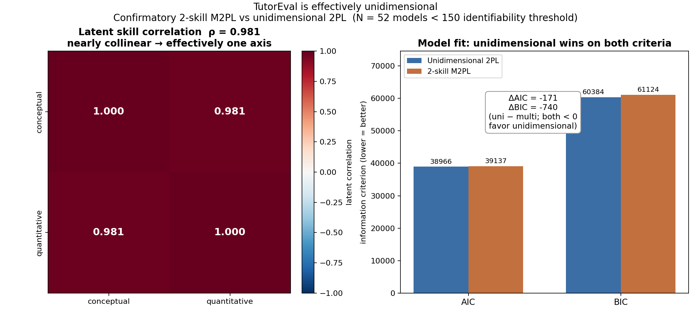
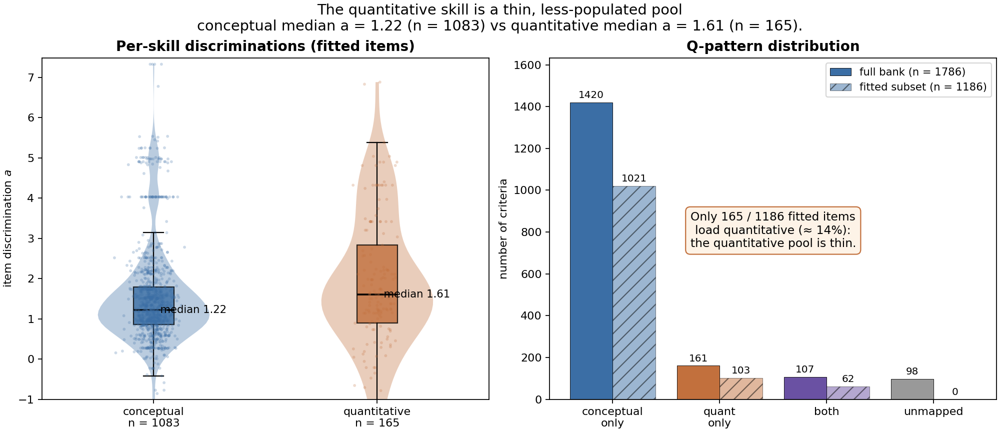
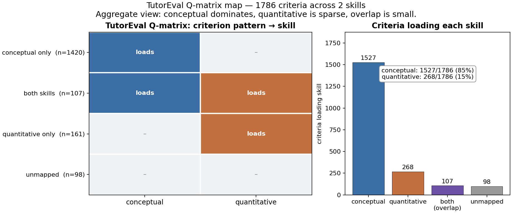
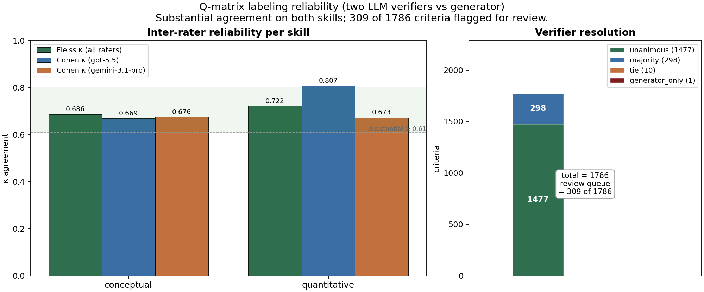

# TutorEval skill-fit figures — index

Clickable index + inline embeds for the TutorEval skill-fit figure set. Four
figures assess whether TutorEval's 2-skill axis (`conceptual_understanding` vs
`quantitative_procedural`) was a good fit. All are regenerated by
[`scripts/plot_tutoreval_skillfit.py`](../../scripts/plot_tutoreval_skillfit.py),
which reads the source artifacts **read-only** and invents no numbers. Full
per-figure detail and source-field provenance live in
[`captions.md`](captions.md).

## Skill-fit set

### Fig 1 — Dimensionality panel
Latent skill-correlation matrix (**ρ = 0.981** between conceptual and
quantitative → nearly collinear, one effective axis) plus AIC/BIC model
comparison — Unidimensional 2PL (AIC 38966, BIC 60384) vs 2-skill M2PL
(AIC 39137, BIC 61124); **ΔAIC = −171, ΔBIC = −740** (uni − multi, both favor
unidimensional). Caveat: **N = 52 models < 150** identifiability threshold.

[fig1_dimensionality.png](fig1_dimensionality.png)

### Fig 2 — Skill-loading visual (the thin quantitative pool)
Per-skill discrimination distributions over the 1,186 fitted items (conceptual
**n = 1083, median a = 1.22** vs quantitative **n = 165, median a = 1.61**) plus
the q-pattern distribution for the full bank vs the fitted subset. Only
**165 / 1186 (≈ 14%)** fitted items load quantitative — the pool is thin.

[fig2_skill_loading.png](fig2_skill_loading.png)

### Fig 3 — TutorEval Q-matrix map
Compact pattern×skill map plus criteria loading each skill over all **1786**
criteria — conceptual **1527 (85%)**, quantitative **268 (15%)**, overlap
`11` = **107**, unmapped `00` = **98**. Conceptual dominates; quantitative is
sparse; overlap is small.

[fig3_qmatrix_map.png](fig3_qmatrix_map.png)

### Fig 4 — Labeling reliability (IRR)
Per-skill **Fleiss κ** (conceptual **0.686**, quantitative **0.722**) and
per-verifier **Cohen κ vs generator** as grouped bars, plus the resolution
breakdown — **unanimous 1477, majority 298, tie 10, generator_only 1**
(total 1786), with **review queue = 309 of 1786** annotated.

[fig4_labeling_irr.png](fig4_labeling_irr.png)

## Related scenario-level CAT figures

Key TutorEval figures from the scenario-level adaptive-testing analysis (all
paths verified to exist relative to this file).

**Efficiency**

- [efficiency_r_vs_scenarios.png](../scenario_level/efficiency_r_vs_scenarios.png)

**K-fold out-of-sample recovery**

- unidim: [oos_recovery_ability.png](../scenario_level/kfold/tutoreval_unidim/figures/oos_recovery_ability.png)
- 2-skill: [oos_recovery_conceptual_understanding.png](../scenario_level/kfold/tutoreval_2skill/figures/oos_recovery_conceptual_understanding.png)
- 2-skill: [oos_recovery_quantitative_procedural.png](../scenario_level/kfold/tutoreval_2skill/figures/oos_recovery_quantitative_procedural.png)

**Item selection (D-optimal vs length trace)**

- unidim: [length_trace_vs_dopt.png](../scenario_level/selection/tutoreval_unidim/figures/length_trace_vs_dopt.png)
- unidim: [length_trace_vs_dopt_scenarios.png](../scenario_level/selection/tutoreval_unidim/figures/length_trace_vs_dopt_scenarios.png)
- unidim: [recovery_trace_vs_dopt_ability.png](../scenario_level/selection/tutoreval_unidim/figures/recovery_trace_vs_dopt_ability.png)
- 2-skill: [length_trace_vs_dopt.png](../scenario_level/selection/tutoreval_2skill/figures/length_trace_vs_dopt.png)
- 2-skill: [length_trace_vs_dopt_scenarios.png](../scenario_level/selection/tutoreval_2skill/figures/length_trace_vs_dopt_scenarios.png)
- 2-skill: [recovery_trace_vs_dopt_conceptual_understanding.png](../scenario_level/selection/tutoreval_2skill/figures/recovery_trace_vs_dopt_conceptual_understanding.png)
- 2-skill: [recovery_trace_vs_dopt_quantitative_procedural.png](../scenario_level/selection/tutoreval_2skill/figures/recovery_trace_vs_dopt_quantitative_procedural.png)

**Order / seed spread**

- unidim: [seed_spread_ability.png](../scenario_level/order/tutoreval_unidim/figures/seed_spread_ability.png)
- 2-skill: [seed_spread_conceptual_understanding.png](../scenario_level/order/tutoreval_2skill/figures/seed_spread_conceptual_understanding.png)
- 2-skill: [seed_spread_quantitative_procedural.png](../scenario_level/order/tutoreval_2skill/figures/seed_spread_quantitative_procedural.png)

**Parameter uncertainty (leaderboard bars)**

- unidim: [leaderboard_bars_ability.png](../scenario_level/param_uncertainty/tutoreval_unidim/figures/leaderboard_bars_ability.png)
- 2-skill: [leaderboard_bars_conceptual_understanding.png](../scenario_level/param_uncertainty/tutoreval_2skill/figures/leaderboard_bars_conceptual_understanding.png)

**K-fold sweep summary**

- [sweep_summary.png](../scenario_level/kfold_sweep/tutoreval_unidim/sweep_summary.png)
- [sweep_summary_scenarios.png](../scenario_level/kfold_sweep/tutoreval_unidim/sweep_summary_scenarios.png)

> Dropped candidate: `param_uncertainty/tutoreval_2skill/figures/leaderboard_bars_quantitative_procedural.png`
> — no such file exists (only `leaderboard_bars_conceptual_understanding.png` is present for the 2-skill run).

## Dimensionality-figure inventory

- **Dedicated:** Fig 1 is the dedicated dimensionality figure (latent ρ = 0.981
  + AIC/BIC unidim vs 2-skill, N = 52 < 150 caveat).
- **Indirect evidence:** Fig 2 (thin quantitative pool: only ≈14% of fitted
  items load quantitative), the 2-skill per-skill OOS recovery figures under
  `kfold/tutoreval_2skill/`, and the 2-skill seed-spread / leaderboard figures
  all bear indirectly on whether the second axis is separable.
- **No second dedicated figure was added.** A per-item `a_conceptual` vs
  `a_quantitative` discrimination scatter would *not* show the ρ = 0.981
  collinearity: that ρ is a latent (person-ability) correlation, already
  rendered directly in Fig 1. Item discriminations are a different quantity —
  among the only 62 / 1186 fitted items that load both skills (the confirmatory
  M2PL zero-masks unmapped skills), the item-level discrimination correlation is
  in fact **negative (Pearson r ≈ −0.71)**. Plotting that while annotating
  ρ = 0.981 would misrepresent the data, so no `fig5` was created.
