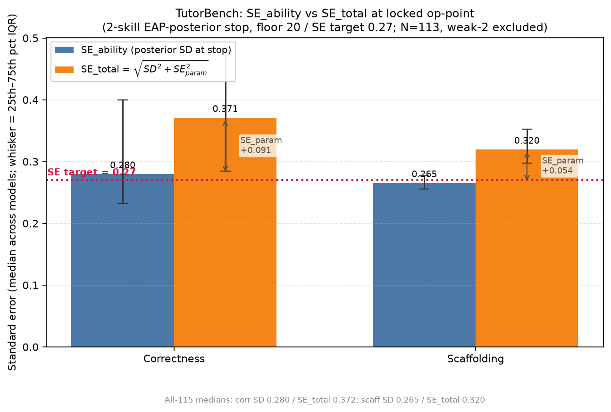

# 07 — parameter uncertainty (SE_param)

**Status: carried over (STOP-INDEPENDENT).** SE_param is a property of the calibrated item bank,
not of the CAT stop rule, so this of-record 2-skill/115 result is carried over unchanged and is
valid under the EAP-posterior stop. It is the FIXED per-model SE_param offset used to form
`SE_total = √(SD_at_stop² + SE_param²)` throughout the EAP experiments (05/06/06b/08).

## Numbers (2-skill, N=115)

- **SE_param floor: median correctness 0.207, scaffolding 0.175** (observed-information
  parametric bootstrap over the administrable bank).
- median SE_posterior 0.334 (corr) / 0.307 (scaff); median SE_total 0.412 / 0.359 at this
  study's own stop; median bar inflation ~1.17× (corr) / 1.14× (scaff).
- These SE_param values are exactly what `eap_oos_grid_study.py` reads as the fixed offset
  (`--se-components`), 0 median-fallbacks across all 115 models.

**Why the ~34% both-skills reach:** SE_param ~0.21 (corr) is the binding precision ceiling —
median SE_total_corr floors at ~0.36 regardless of how tight the SD target is set. Additional
administration cannot reduce the fixed item-parameter uncertainty.

## SE_ability vs SE_total at the LOCKED op-point (20 / 0.27)

`figures/se_ability_vs_total_bars.png` is the headline grouped-bar chart (both skills), and it
reflects the **LOCKED operating point**: 2-skill EAP-posterior stop, floor 20 / SE_ability
target 0.27. For each skill it shows two bars:

- **SE_ability** = median posterior SD at stop.
- **SE_total** = median √(SD² + SE_param²), where SE_param is the fixed per-model
  parameter-uncertainty offset from the min12 bootstrap.

The SE_ability→SE_total gap on each pair is the **SE_param contribution**. Whiskers are the
25th–75th percentile (IQR) across models; the dotted crimson line marks the SE target = 0.27.
The headline chart **excludes the 2 weak-calibrated models** (`Qwen/Qwen1.5-1.8B`,
`BSC-LT/salamandra-7b-instruct`), N = 113; all-115 medians are shown as a faint secondary note.

Medians plotted (excl-2): correctness SE_ability **0.280** / SE_total **0.371**; scaffolding
SE_ability **0.265** / SE_total **0.320** — matching the of-record 20/0.27 grid medians.

> NOTE: this chart is at the LOCKED max_se = 0.27 op-point (SE_ability = posterior SD at stop;
> SE_param from the min12 bootstrap offset). It is **distinct** from the carried-over legacy
> `leaderboard_se_components.csv` below, which was computed at the old **max_se = 0.30** study
> stop and is retained only for the stop-independent SE_param offset.

- Data source: `reports/eap_oos_grid_tutorbench_2skill/of_record_f20se27/leaderboard_f20se27.csv`.
- `se_ability_vs_total_summary.csv` — per-skill median + IQR (p25/p75) for SE_ability and
  SE_total used in the chart, plus all-115 medians.

## Files

- `leaderboard_se_components.csv` — per-model SE_posterior / SE_param / SE_total per skill (legacy max_se=0.30).
- `metrics.json` — bootstrap config + SE-component medians.
- `figures/leaderboard_bars_correctness.png` — SE-component bars.
- `figures/se_ability_vs_total_bars.png` — SE_ability vs SE_total bars at locked 20/0.27 op-point.
- `se_ability_vs_total_summary.csv` — medians + IQRs backing the locked-op-point chart.

## Provenance

`scripts/scenario_param_uncertainty.py`. Original:
`regenerated_figures/scenario_level_115_min12/param_uncertainty/2_skills/`.
